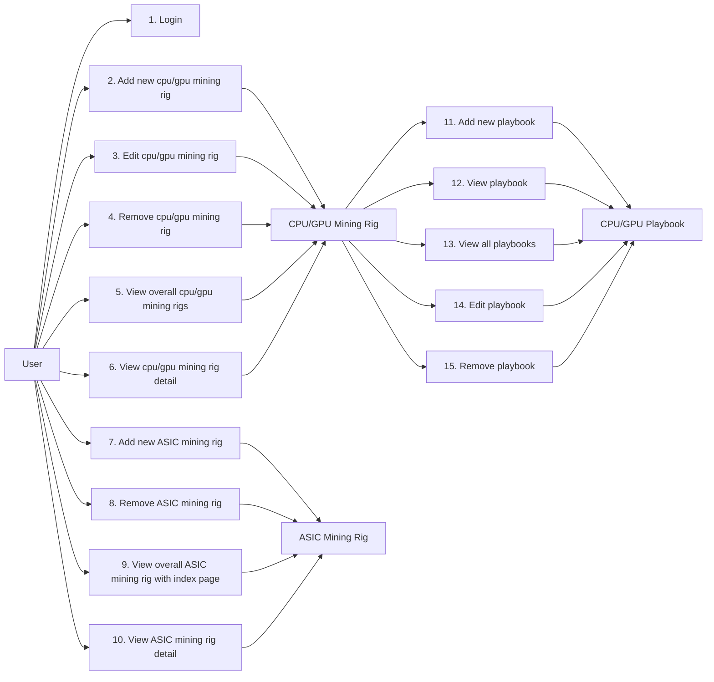

# 2. Feature List
- Remote control mining rigs cpu/gpu including assign mining software (such as bzminer, lolminer, xmrig...), mining pool, mining address.
- Allow multiple mining software running (cpu miner, gpu miner).
- Monitor cpu/gpu miner.
- Monitor asic miner.
- The UI is heavily interactive between many active login session.

