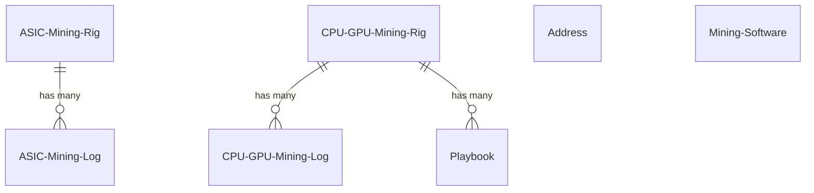
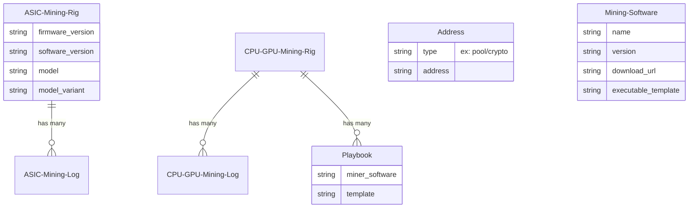

# 4. Implementation Details

## 1. Entity Relationship Diagram

```mermaid
erDiagram
    ASIC-Mining-Rig ||--o{ ASIC-Mining-Log : "has many"
    CPU-GPU-Mining-Rig ||--o{ CPU-GPU-Mining-Log : "has many"
    CPU-GPU-Mining-Rig ||--o{ Playbook : "has many"
    Playbook
    Address
    Mining-Software

```

## 2. Database diagram

```mermaid
erDiagram
    ASIC-Mining-Rig ||--o{ ASIC-Mining-Log : "has many"
    CPU-GPU-Mining-Rig ||--o{ CPU-GPU-Mining-Log : "has many"
    CPU-GPU-Mining-Rig ||--o{ Playbook : "has many"


    Address {
        string type "ex: pool/crypto"
        string address
    }

    Playbook {
        string miner_software
        string template
    }

    Mining-Software {
        string name
        string version
        string download_url
        string executable_template
    }

    ASIC-Mining-Rig {
        string firmware_version
        string software_version
        string model
        string model_variant
    }

```
