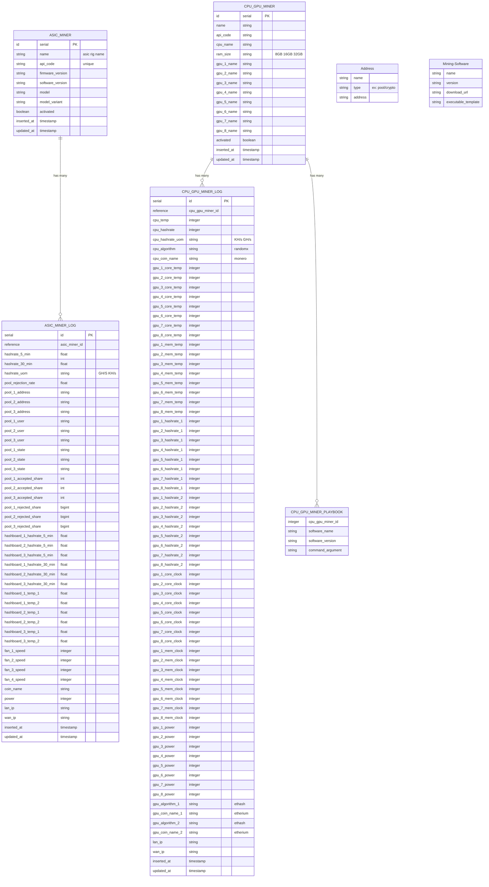

---
hide:
  - navigation
  - toc
---

# 4.1.2. Database diagram

```mermaid
erDiagram
    ASIC_MINER ||--o{ ASIC_MINER_LOG : "has many"
    CPU_GPU_MINER ||--o{ CPU_GPU_MINER_LOG : "has many"
    CPU_GPU_MINER ||--o{ CPU_GPU_MINER_PLAYBOOK: "has many"


    Address {
        string name
        string type "ex: pool/crypto"
        string address
    }

    Mining-Software {
        string name
        string version
        string download_url
        string executable_template
    }

    ASIC_MINER {
        id serial PK
        string name "asic rig name"
        string api_code "unique"
        string firmware_version
        string software_version
        string model
        string model_variant
        boolean activated

        inserted_at timestamp
        updated_at timestamp
    }

    ASIC_MINER_LOG {
        serial id PK
        reference asic_miner_id
        hashrate_5_min float
        hashrate_30_min float
        hashrate_uom string "GH/S KH/s"

        pool_rejection_rate float

        pool_1_address string
        pool_2_address string
        pool_3_address string

        pool_1_user string
        pool_2_user string
        pool_3_user string

        pool_1_state string
        pool_2_state string
        pool_3_state string

        pool_1_accepted_share int
        pool_2_accepted_share int
        pool_3_accepted_share int

        pool_1_rejected_share bigint
        pool_2_rejected_share bigint
        pool_3_rejected_share bigint


        hashboard_1_hashrate_5_min float
        hashboard_2_hashrate_5_min float
        hashboard_3_hashrate_5_min float

        hashboard_1_hashrate_30_min float
        hashboard_2_hashrate_30_min float
        hashboard_3_hashrate_30_min float

        hashboard_1_temp_1 float
        hashboard_1_temp_2 float

        hashboard_2_temp_1 float
        hashboard_2_temp_2 float

        hashboard_3_temp_1 float
        hashboard_3_temp_2 float

        fan_1_speed integer
        fan_2_speed integer
        fan_3_speed integer
        fan_4_speed integer

        coin_name string
        power integer

        lan_ip string
        wan_ip string

        inserted_at timestamp
        updated_at timestamp
    }

    CPU_GPU_MINER {
        id serial PK
        name string
        api_code string
        cpu_name string
        ram_size string "8GB 16GB 32GB"

        gpu_1_name string
        gpu_2_name string
        gpu_3_name string
        gpu_4_name string
        gpu_5_name string
        gpu_6_name string
        gpu_7_name string
        gpu_8_name string

        activated boolean

        inserted_at timestamp
        updated_at timestamp
    }

    CPU_GPU_MINER_LOG {
        serial id PK
        reference cpu_gpu_miner_id

        cpu_temp integer
        cpu_hashrate integer
        cpu_hashrate_uom string "KH/s GH/s"
        cpu_algorithm string "randomx"
        cpu_coin_name string "monero"

        gpu_1_core_temp integer
        gpu_2_core_temp integer
        gpu_3_core_temp integer
        gpu_4_core_temp integer
        gpu_5_core_temp integer
        gpu_6_core_temp integer
        gpu_7_core_temp integer
        gpu_8_core_temp integer

        gpu_1_mem_temp integer
        gpu_2_mem_temp integer
        gpu_3_mem_temp integer
        gpu_4_mem_temp integer
        gpu_5_mem_temp integer
        gpu_6_mem_temp integer
        gpu_7_mem_temp integer
        gpu_8_mem_temp integer

        gpu_1_hashrate_1 integer
        gpu_2_hashrate_1 integer
        gpu_3_hashrate_1 integer
        gpu_4_hashrate_1 integer
        gpu_5_hashrate_1 integer
        gpu_6_hashrate_1 integer
        gpu_7_hashrate_1 integer
        gpu_8_hashrate_1 integer

        gpu_1_hashrate_2 integer
        gpu_2_hashrate_2 integer
        gpu_3_hashrate_2 integer
        gpu_4_hashrate_2 integer
        gpu_5_hashrate_2 integer
        gpu_6_hashrate_2 integer
        gpu_7_hashrate_2 integer
        gpu_8_hashrate_2 integer

        gpu_1_core_clock integer
        gpu_2_core_clock integer
        gpu_3_core_clock integer
        gpu_4_core_clock integer
        gpu_5_core_clock integer
        gpu_6_core_clock integer
        gpu_7_core_clock integer
        gpu_8_core_clock integer

        gpu_1_mem_clock integer
        gpu_2_mem_clock integer
        gpu_3_mem_clock integer
        gpu_4_mem_clock integer
        gpu_5_mem_clock integer
        gpu_6_mem_clock integer
        gpu_7_mem_clock integer
        gpu_8_mem_clock integer

        gpu_1_power integer
        gpu_2_power integer
        gpu_3_power integer
        gpu_4_power integer
        gpu_5_power integer
        gpu_6_power integer
        gpu_7_power integer
        gpu_8_power integer

        gpu_algorithm_1 string "ethash"
        gpu_coin_name_1 string "etherium"
        gpu_algorithm_2 string "ethash"
        gpu_coin_name_2 string "etherium"

        lan_ip string
        wan_ip string

        inserted_at timestamp
        updated_at timestamp
    }

    CPU_GPU_MINER_PLAYBOOK {
        integer cpu_gpu_miner_id
        string software_name
        string software_version
        string command_argument
    }

```
