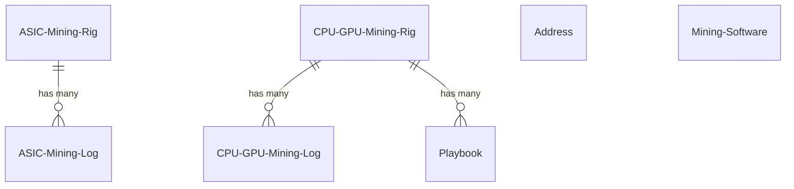

# 4.1 ERD & DB diagrams

## 1. Entity Relationship Diagram

```mermaid
erDiagram
    ASIC-Mining-Rig ||--o{ ASIC-Mining-Log : "has many"
    CPU-GPU-Mining-Rig ||--o{ CPU-GPU-Mining-Log : "has many"
    CPU-GPU-Mining-Rig ||--o{ Playbook : "has many"
    Playbook
    Address
    Mining-Software

```

## 2. Database diagram
To view fullscreen, visit [link](../04.1.2-db-diagram-fullscreen)
