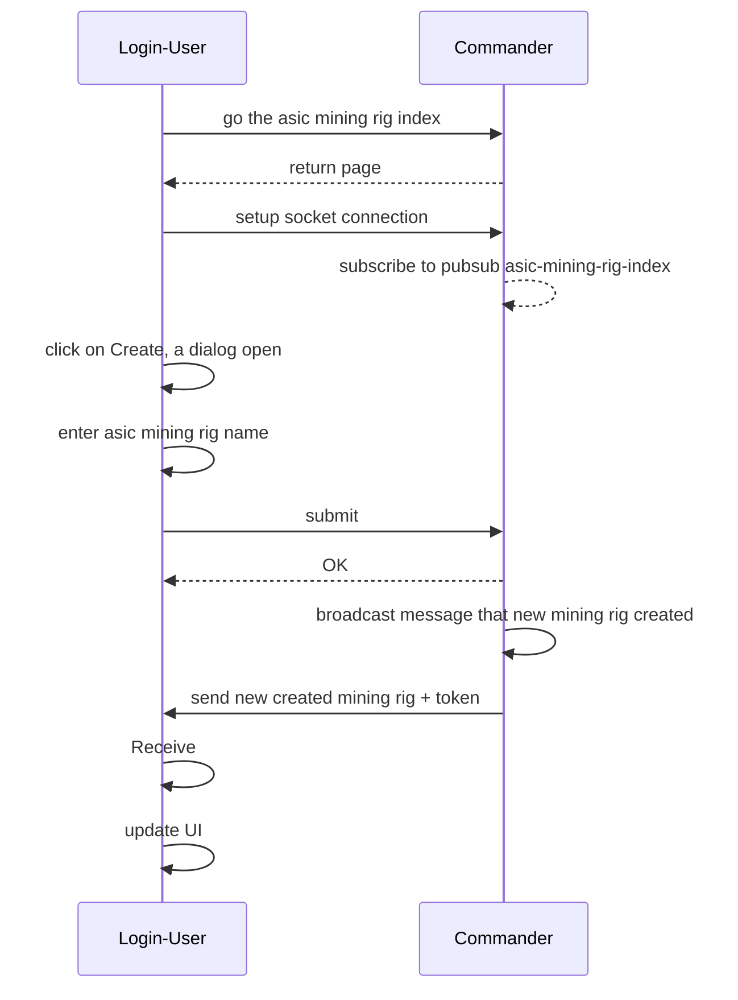
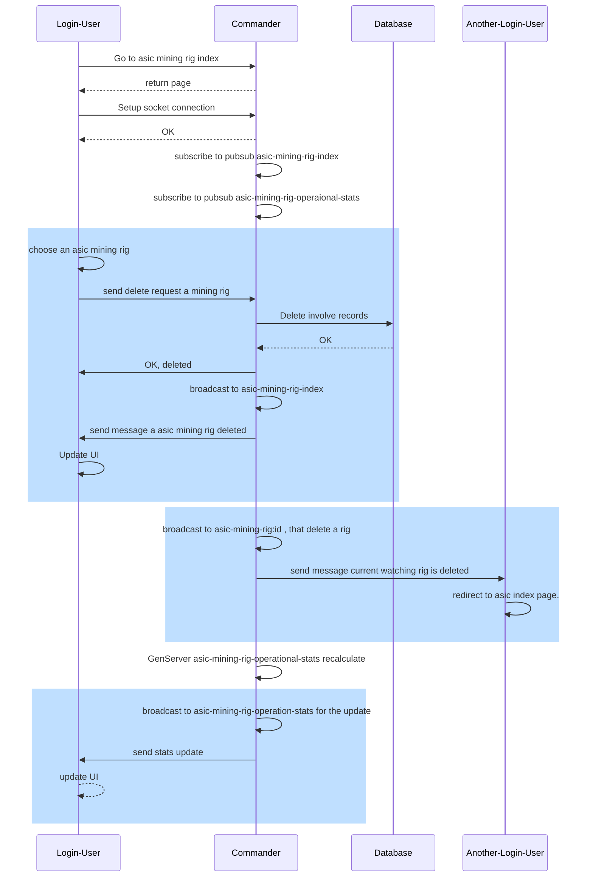
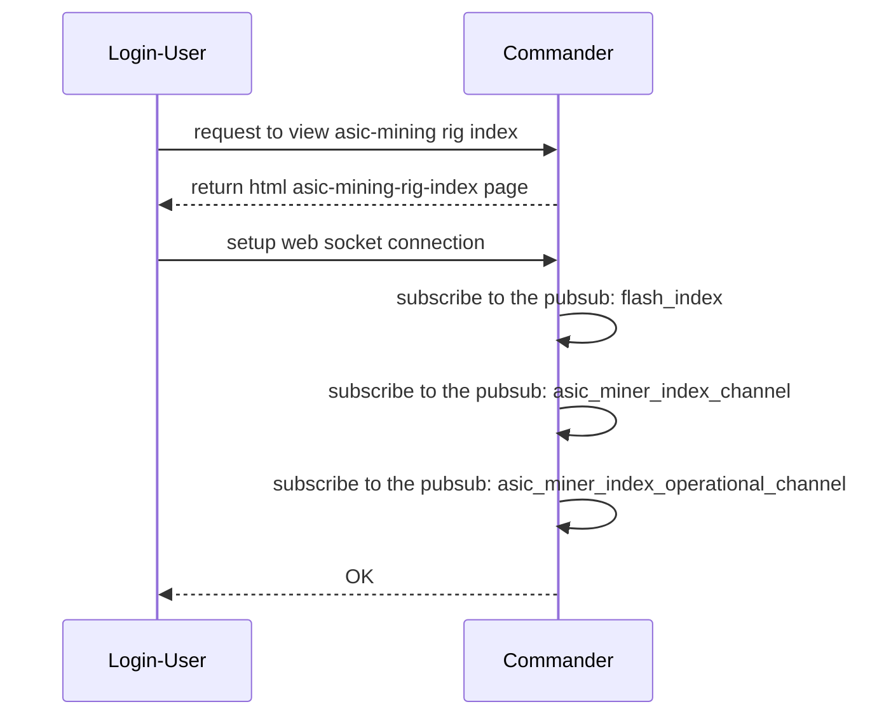
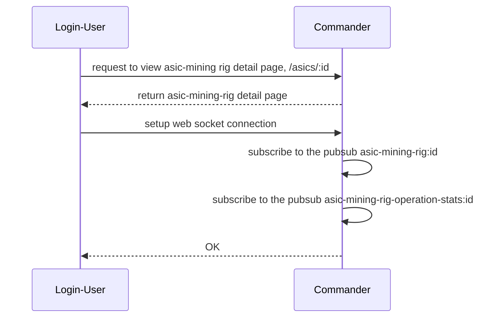

# 4.5 ASIC Related Features

## Feature 7: Add new ASIC mining rig
This feature requried users to do two phrases:

- setup in commander
- setup in sentry

Unlike cpu/gpu mining rig, we cannot install sentry on each asic. There is a machine installed sentry,
and this sentry will fetch logs from many asics.

In this sequence diagram, the `Login-User` does also mean the web browser.

On the sentry side, user needs to know asic IP first. After that, in the sentry UI, add

- ASIC IP
- ASIC Model (required to determine fetching log solution)
- ASIC Token: provide in the first phrase.

## Feature 8: Remove ASIC mining rig
This feature remove mining rig from dashboard to monitor. On the senry side, the mining rig still exist, but dislay an invalid token.

## Feature 9: View overall ASIC mining rig with index page
This feature allows users to view asic mining rig overview, and view aggregate figures such as total hashrate by coin, power consumption.

An action list which affect UI in realtime:

- (1)`ASIC miner`
    - CREATE new ASIC miner: a new miner appear in **not_activated table**
    - UPDATE old ASIC miner: update asic miner name if exist in **not_activated table** and **activated table**
    - DELETE old AISC miner: delete asic miner if exist in **not_activated table** and **activated table**
- (2)`Sentry` send `ASIC miner` specification to `Commander`, change asic miner from **not activated table** to **activated table**
  with new specification data

- (3)`Sentry` send operational log of `ASIC miner` to `Commander`. change asic miner operational data such as `hashrate, temperature ...` in the **activated table**

This is a sequence diagram showing that user viewing `/asic_miners/` given that **user has login successfully!**

There are two pubsub channel that we use here for broadcasting changes:

- `asic_miner_index`: to receive message incase of create/update/delete asic miner
- `asic_miner_operational_channel`: to receive message about minining operation such as total hashrate, power consumption, temperature , and aggregated data.

!!! Note "The pubsub channel does not store data. The real data is store in `AsicMinerOperationalIndex` process, these process be update as sentry send data to `Commander`."

This is a wireframe for asic mining rig index.

## Feature 10: View ASIC mining rig detail

There are two pubsub channel using here:
- `asic-mining-rig:id`: for mining rig data update, such as name
- `asic-mining-rig-operation-stats:id`: for mininig operational stats

This is a wireframe when sentry finished sending data to `Commander`.

