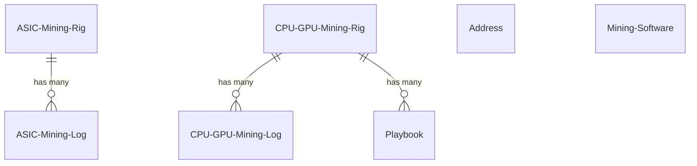
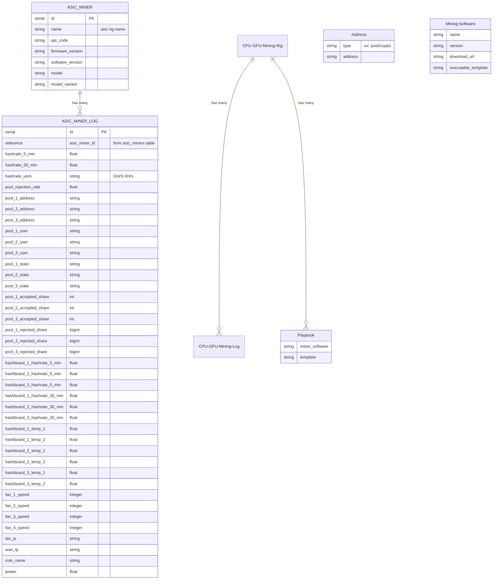

# 4.1 ERD & DB diagrams

## 1. Entity Relationship Diagram

```mermaid
erDiagram
    ASIC-Mining-Rig ||--o{ ASIC-Mining-Log : "has many"
    CPU-GPU-Mining-Rig ||--o{ CPU-GPU-Mining-Log : "has many"
    CPU-GPU-Mining-Rig ||--o{ Playbook : "has many"
    Playbook
    Address
    Mining-Software

```

## 2. Database diagram

```mermaid
erDiagram
    ASIC_MINER ||--o{ ASIC_MINER_LOG : "has many"
    CPU-GPU-Mining-Rig ||--o{ CPU-GPU-Mining-Log : "has many"
    CPU-GPU-Mining-Rig ||--o{ Playbook : "has many"


    Address {
        string type "ex: pool/crypto"
        string address
    }

    Playbook {
        string miner_software
        string template
    }

    Mining-Software {
        string name
        string version
        string download_url
        string executable_template
    }

    ASIC_MINER {
        serial id PK
        string name "asic rig name"
        string api_code
        string firmware_version
        string software_version
        string model
        string model_variant

    }

    ASIC_MINER_LOG {
        serial id PK
        reference asic_miner_id "from asic_miners table"
        hashrate_5_min float
        hashrate_30_min float
        hashrate_uom string "GH/S KH/s"

        pool_rejection_rate float

        pool_1_address string
        pool_2_address string
        pool_3_address string

        pool_1_user string
        pool_2_user string
        pool_3_user string

        pool_1_state string
        pool_2_state string
        pool_3_state string

        pool_1_accepted_share int
        pool_2_accepted_share int
        pool_3_accepted_share int

        pool_1_rejected_share bigint
        pool_2_rejected_share bigint
        pool_3_rejected_share bigint


        hashboard_1_hashrate_5_min float
        hashboard_2_hashrate_5_min float
        hashboard_3_hashrate_5_min float

        hashboard_1_hashrate_30_min float
        hashboard_2_hashrate_30_min float
        hashboard_3_hashrate_30_min float

        hashboard_1_temp_1 float
        hashboard_1_temp_2 float

        hashboard_2_temp_1 float
        hashboard_2_temp_2 float

        hashboard_3_temp_1 float
        hashboard_3_temp_2 float

        fan_1_speed integer
        fan_2_speed integer
        fan_3_speed integer
        fan_4_speed integer

        lan_ip string
        wan_ip string

        coin_name string
        power float
    }

```
