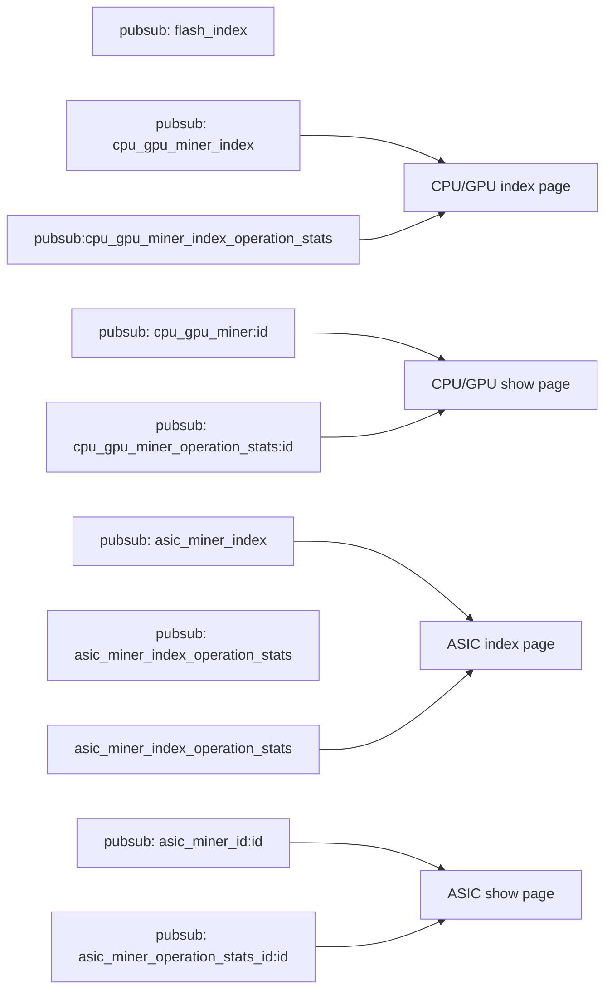

# 4.2 Pubsub channel summary
This software support rich UI/UI realtime update & interaction shared between all active login session. As a consequence, this is a list of pubsub channel.

- `flash_index`: for broadcast flash messages

## CPU/GPU miner pubsub channels

- `cpu_gpu_miner_index`
- `cpu_gpu_miner_index_operation_stats`
- `cpu_gpu_miner:id`
- `cpu_gpu_miner_operation_stats:id`

## ASIC miner pubsub channels

- `asic_miner_index_channel`
- `asic_miner_index_operational_channel`

- `asic_miner_id:id`
- `asic_miner_operation_stats_id:id`

