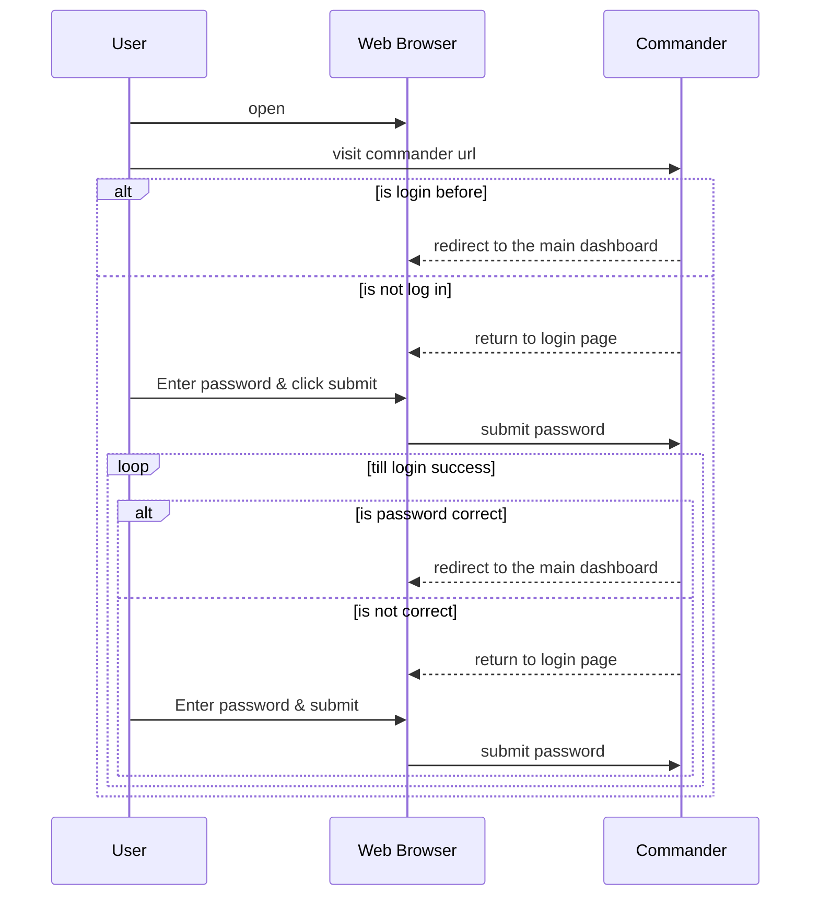
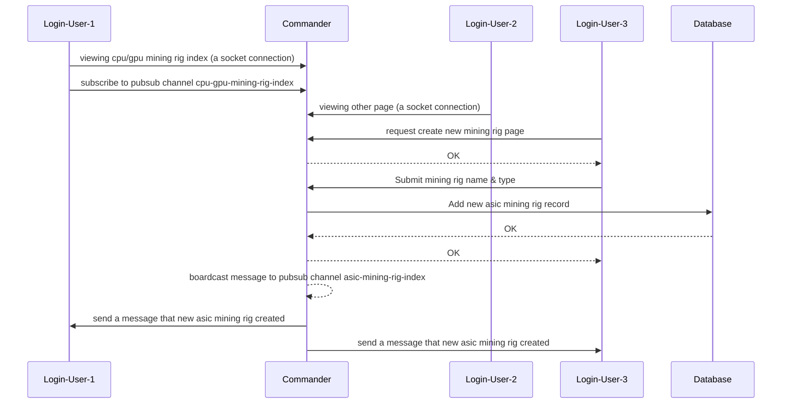
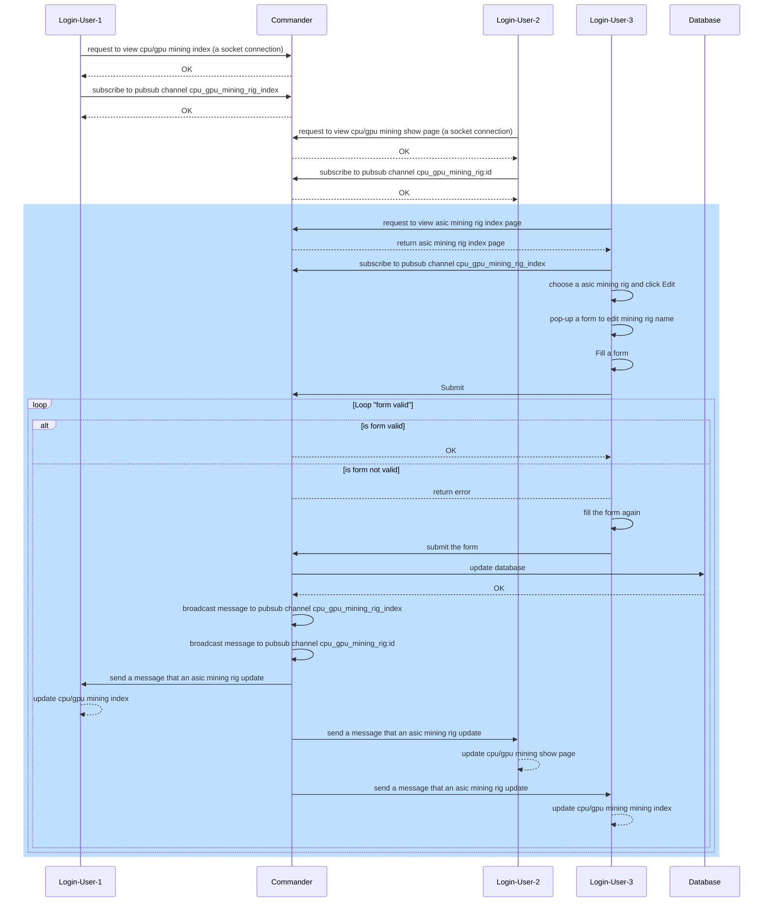
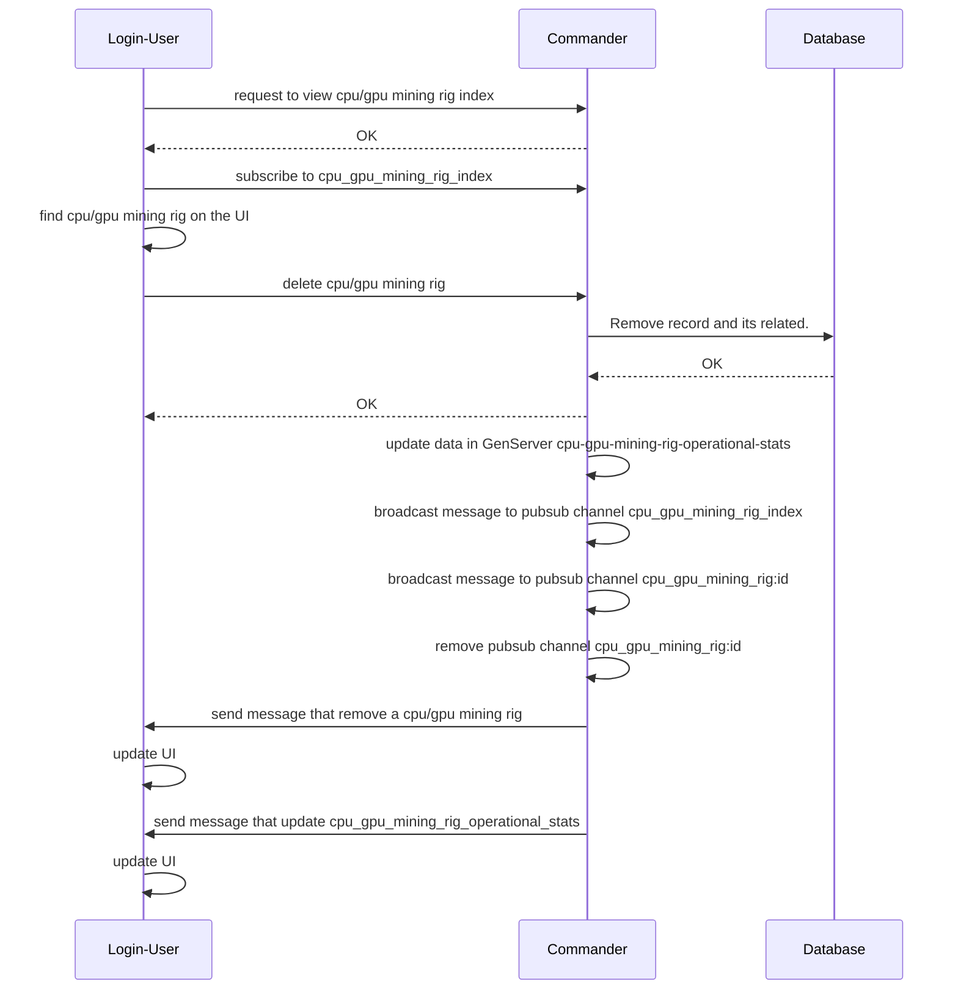
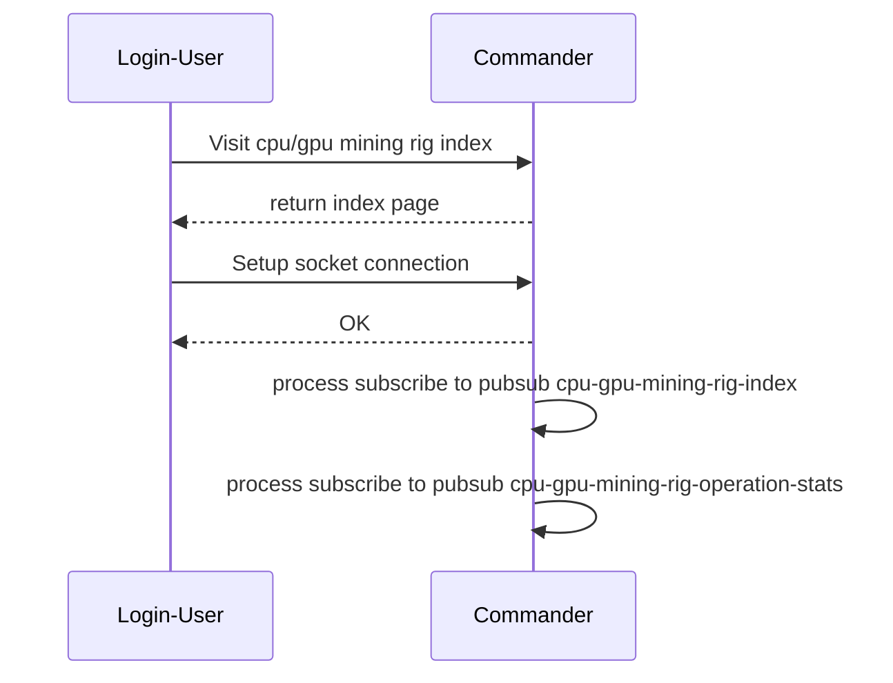
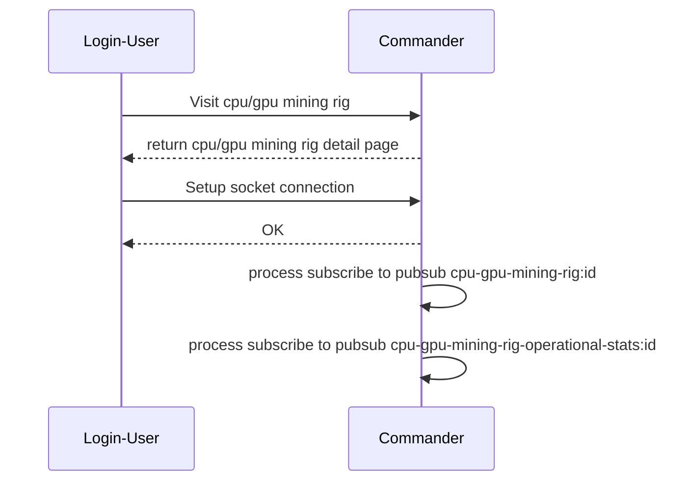

# 4.4 CPU/GPU Related Features

## Feature 1: Login
The software is selfhost and  does not have user credentials system. At the time sysadmin deploy the `commander`, there is a configuration for **password**.

!!! note "There is no **limit** number of active login session."

## Feature 2: Add new cpu/gpu mining rig
Login user are capable create a new cpu/gpu mining rig to monitor, There are two required attributes that users need to provide:

- `mining rig name`: should be distinct
- `mining rig type` (cpu/gpu or asic)

On the other hand, server will return `token`. This token will be used when setup sentry after installing `sentry` on the `cpu/gpu mining rig`.

In addition, given that there are many active login session, here are usecase:

- A new asic mining rig created, people who are viewing `asic mining rig index page`, they will see a new entry on their
`asic mining rig index page` without refresh the page.
- For those who are not viewing `asic mining rig index`, they will not see different nor receive that data payload from
commander about the `new asic mining rig` created

!!! Note "Login-User-2 does not receive message that new asic mining rig created."

The broadcast channel named: `cpu-gpu-mining-rig-index`

Data payload schema: `{:asic_mining_rig_index, :created, mining_rig}`

## Feature 3: Edit CPU/GPU mining rig
This feature allows user edit `mining rig name` only. Similar UI realtime update logic as creating new `cpu/gpu mining rig`. Other active login users get
update if they are viewing `asic-mining-rig-index`.

In the sequence diagram below, we consider Login-User-3 is an entity which include his/her web browser.

There are two pubsub channels involved:

- `cpu_gpu_mining_rig_index`
    - data payload schema for subscriber: `{:cpu-gpu_mining_rig_index, :updated, mining_rig}`
- `cpu_gpu_mining_rig:mining_rig_id`, mining-rig-id is the primary key of cpu/gpu mining rig.
    - data payload schema for subscriber: `{:cpu_gpu_mining_rig:id, :updated, mining_rig}`.

## Feature 4: Remove cpu/gpu mining rig
This feature involves `Commander` and `Sentry`. When user remove `cpu/gpu mining rig` on commander, and `sentry` is setup on mining rig,
`sentry` will do the following actions

- stop all running playbooks
- remove all playbook and mining software such as xmrig, phoenix miner, bzminer ...
- stop sending log to `commander`
- open an UI asking for `token`

!!! Note "GenServer cpu-gpu-mining-rig-index-operational-stats"
    This genserver store aggregate stats of many cpu/gpu mining rigs such as: total hashrate by coin, total power consumption.
    When a mining rig removed, this stats need to be updated.

!!! Note "For active loging user viewing cpu-gpu mining rig detail/show page"
    Cause they are viewing a mining rig which is deleted, they will be redirect to cpu-gpu-mining-rig-index page

## Feature 5: View overall cpu/gpu mining rigs

This feature allows user view overall all cpu/gpu mining rigs (cpu/gpu mining rig index page). This page has realtime update data.
When user visit this page, a socket connection established. on the web framework Phoenix, this socket connection process subscribe to a pubsub
channel

- `cpu-gpu-mining-rig-index`: only for cpu/gpu mining rig
- `cpu-gpu-mining-rig-operational-stats`: only for cpu/gpu mining rig operational stats, such as hashrate, total hashrate by coin,
aggregated stats for all rigs.

This is a list of all data indexs displayed on this page.

- Aggregated Data
    - Total hashrate of all available CPU/GPU mining rig at the moment per crypto currency.
      (pick latest data, group by crypto name, sum hashrate).
    - How many cpu/gpu mining rigs running (pick latest data < 2min, count machine)
    - Total power consumption of all available/running CPU/GPU mining rigs
      (pick latest data, group by crypto name, sum hashrate)

- Individual Data
    - Hashrate
    - Crypto Currency
    - Max CPU Temperature
    - All GPU Core Temperature
    - All GPU Memory Temperature
    - Power Consumption (A sum of all gpu power consumption)
    - Uptime (count since Sentry started)

- Chart
    - Historical hashrate by crypto currency.

This is a wireframe for this feature.

Aggregated indexs should not abuse Database, we can use GenServer as a cache memory to avoid DB READ. At the time `Commander` insert a new mining log, GenServer update its memory.

## Feature 6: View cpu/gpu mining rig detail

This feature allows user view cpu/gpu mining rig details with realtime update data. All the data is updated in readtime.

- mining rig name
- mining rig specs
- mining operational index: power consumption, hashrate, fan speed
- historical hashrate in chart

When user visit this page, a socket connection established. On the web framework Phoenix, this socket connection process subscribe to a pubsub
channel
- `cpu-gpu-mining-rig:id`: for mining rig data such as spec, name
- `cpu-gpu-mining-rig-operation-stats:id`: for operational data.

On this page, if mining rig update (such as rig name), a message will broadcasted to channel `cpu-gpu-mining-rig:id`.

As a subcriber, the listener need to handle these schema in `handle_info/3`
- `{cpu-gpu-mining-rig, :updated, mining_rig}`
- `{cpu-gpu-mining-rig, :deleted, mining_rig}`, if this message received, redirect user to the cpu/gpu mining rig index page.

In addition, if mining rig operational data get updated, a message will be broadcasted to channel `cpu-gpu-mining-rig-operational-stats:id`

- `{cpu-gpu-mining-rig-operational-stats, :created, new_log`

## 12. Feature 11: Add new playbook (TBD)
## 13. Feature 12: View playbook (TBD)
## 14. Feature 13: View all playbook (TBD)
## 15. Feature 14: Edit playbook (TBD)
## 16. Feature 15: Remove playbook (TBD)
