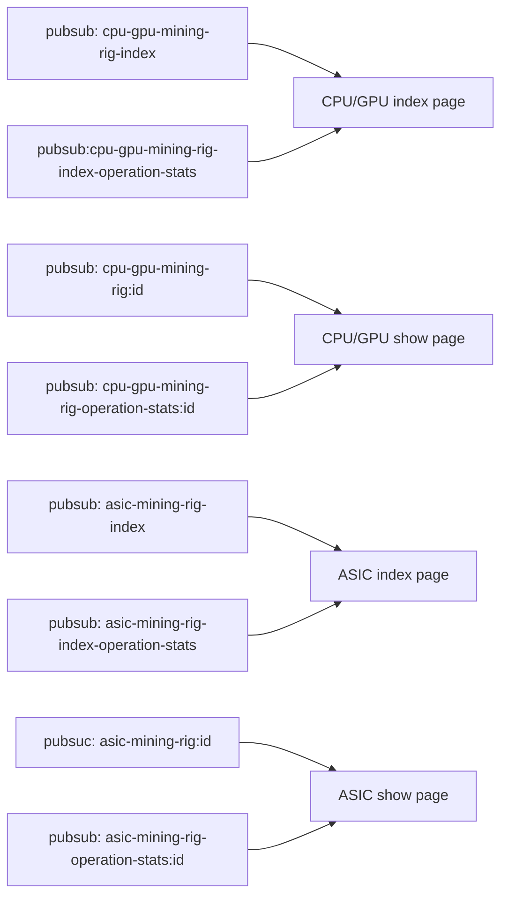

# 4a. Pubsub channel summary
This software support rich UI/UI realtime update & interaction shared between all active login session. As a consequence, this is a list of pubsub channel.

- `cpu-gpu-mining-rig-index`
- `cpu-gpu-mining-rig-index-operation-stats`
- `cpu-gpu-mining-rig:id`
- `cpu-gpu-mining-rig-operation-stats:id`

- `asic-mining-rig-index`
- `asic-mining-rig-index-operation-stats`
- `asic-mining-rig-id:id`
- `asic-mining-rig-operation-stats-id:id`

