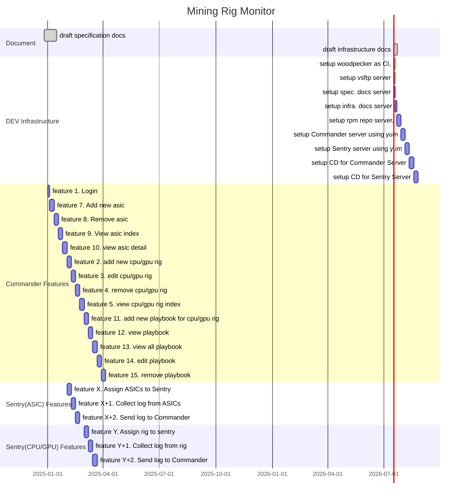

# 6. Project management

To view fullscreen, visit [project management fullscreen](../06-project-management-fullscreen/)

```mermaid
gantt
    title Mining Rig Monitor
    dateFormat YYYY-MM-DD

    section Document
        draft specification  docs      :done, :wsd, 2024-12-26, 20d
        draft infrastructure docs      :done, :wid, after wsd, 5d
    section DEV Infrastructure
        setup woodpecker as CI,        :done, :swci, after wid, 2d
        setup vsftp server             :done, :svsftp, after swci, 2d
        setup spec. docs server        :ssds, after svsftp, 2d
        setup infra. docs server       :sids, after ssds, 2d
        setup rpm repo server,         :srps, after sids, 1w

        setup Commander server using yum :scs, after srps, 1w
        setup Sentry server using yum    :sss, after scs, 1w
        setup CD for Commander Server   :scdcs, after sss, 1w
        setup CD for Sentry Server      :scdss, after scdcs, 1w
    section Commander Features
        feature  1. Login              :f01, 2025-01-01, 3d

        feature  7. Add new asic       :f07, after f01, 1w
        feature  8. Remove asic        :f08, after f07, 1w
        feature  9. View asic index    :f09, after f08, 1w
        feature 10. view asic detail   :f10, after f09, 1w

        feature 2. add new cpu/gpu rig    :f02, after f10, 1w
        feature 3. edit cpu/gpu rig       :f03, after f02, 1w
        feature 4. remove cpu/gpu rig     :f04, after f03, 1w
        feature 5. view cpu/gpu rig index :f05, after f04, 1w

        feature 11. add new playbook for cpu/gpu rig  :f11, after f05, 1w
        feature 12. view playbook                     :f12, after f11, 1w
        feature 13. view all playbook                 :f13, after f12, 1w
        feature 14. edit playbook                     :f14, after f13, 1w
        feature 15. remove playbook                   :f15, after f14, 1w

    section Sentry(ASIC) Features
        feature X. Assign ASICs to Sentry    :fx,  after f10, 1w
        feature X+1. Collect log from ASICs  :fx1, after fx,  1w
        feature X+2. Send log to Commander   :fx2, after fx1, 1w

    section Sentry(CPU/GPU) Features
        feature Y. Assign rig to sentry    :fy, after f05, 1w
        feature Y+1. Collect log from rig  :fy1, after fy, 1w
        feature Y+2. Send log to Commander :fy2, after fy1, 1w

```
