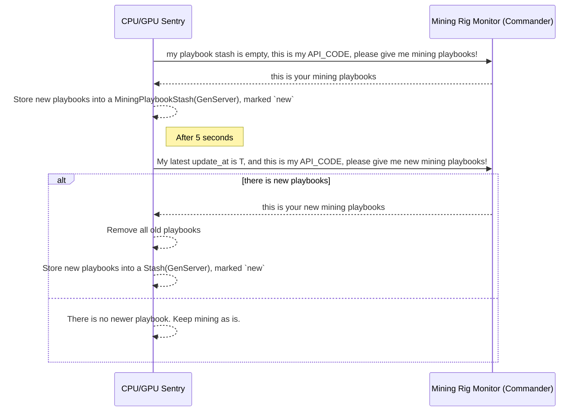
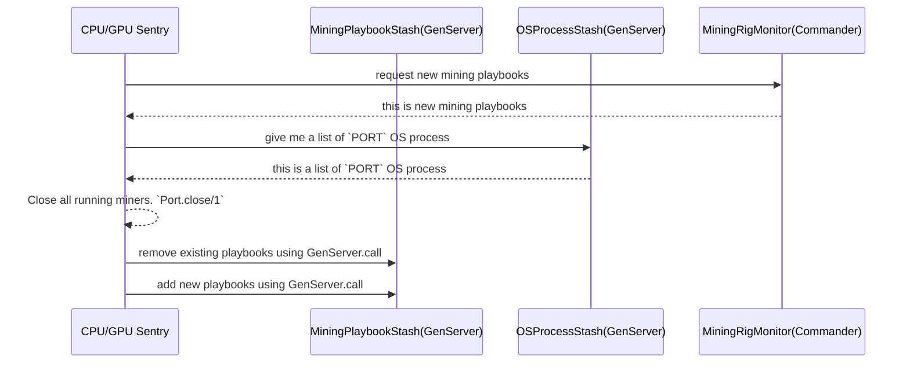

# Feature 1: Fetching newer mining playbooks regularly

## I. What is a minining playbooks
A term `playbook`, I takes it from `ansible`, `ansible playbook`. It indicates how a computer should mine a crypto currency.
A mining playbook include but not limited to:

- A miner software
- Its version
- argument list passing to the miner software
    - address
    - worker name
    - pool

## II. Sequence Diagram (between Sentry and Commander)

## III. Sequence Diagram (Sentry internal)
 Tôi muốn giảm GEN SERVER

