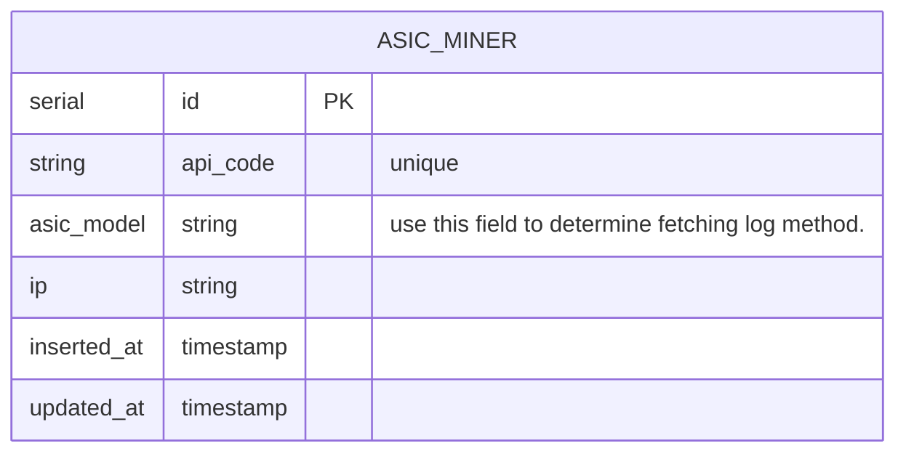

---
# 5.1. ASIC Sentry - Database Diagram

```mermaid
erDiagram
    ASIC_MINER

    ASIC_MINER {
        serial id PK
        string api_code "unique"
        asic_model string "use this field to determine fetching log method."
        ip string
        inserted_at timestamp
        updated_at timestamp
    }


```
