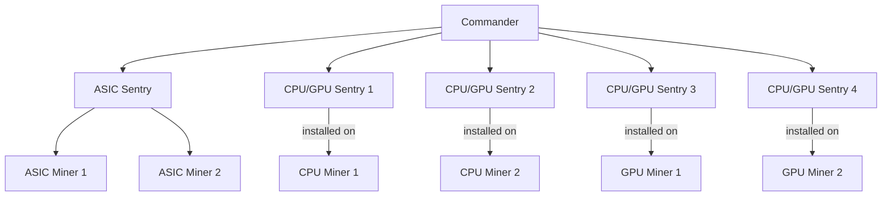
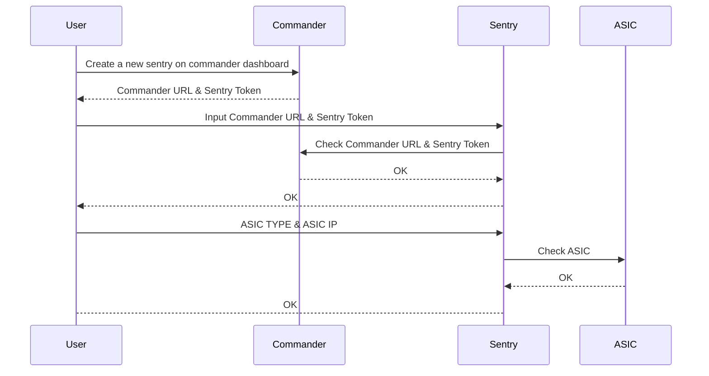

# Index

## Abstract
There are two three tiers regarding monitoring mining rigs.

- commander
- sentry
- mining rig:
    - gpu miner
    - cpu miner
    - asic miner

The source code is focusing on the `commander` and `sentry`.  There is one `commander` for mining farm, and many `sentry`. A sentry is installed on each `gpu miner`/ `cpu miner`. On the other hand, one sentry can monitor many `asic miner`.

Regarding sentry, **sentry source code** for `asic miners` should be diffirent from **sentry** for `cpu/gpu miners`.

One `asic sentry` can monitor many `asic miners`.

One `cpu / gpu sentry` can monitor one `cpu/gpu miner`. **Beware that a machine can mine with CPU and GPU at the sametime.**

When `sentry` get operational data from `miners`, they will report/forward data to the `commander`.

In addition, the diagram above does not represent how we do deploy cause it does not have backup machine for `commander`.

## How to setup a sentry for asic miners?

