# Index

## I. Introduction
At first, I am inspired of many mining rig monitor software such as Minerstats, HiveOS, BrainOS. They do good jobs, They really help the community so much, the crypto industry
really appriciate their contribution. In particular, I am a minerstats user, and I love their software! Really cool! This software is an opensource version of Minerstat which
do monitor mining rigs.

For a mining farm, they can selfhost this software and play with it!

If someone could create such a great thing and opensource it (Bitcoin, Monero, Xmrig, Linux kernel, and many many thing ....), yes, this piece of software can be opensource too!

I will try my best to deliver it, and I really hope so! Or it's just another time, I would fail! but it's worth a try!

---
There are two three tiers regarding monitoring mining rigs.

- Commander
- Sentry
- Mining rig:
    - GPU miner
    - CPU miner
    - ASIC miner

The source code is focusing on the `commander` and `sentry`.  There is one `commander` for mining farm, and many `sentry`. A sentry is installed on each `gpu miner`/ `cpu miner`. On the other hand, one sentry can monitor many `asic miner`.

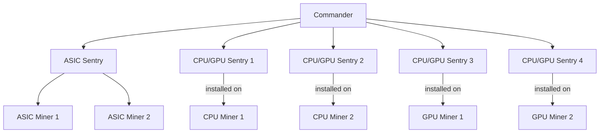
```mermaid
flowchart TB
    Commander[Commander]
    Commander --> AsicSentry[ASIC Sentry]
    AsicSentry --> AM1[ASIC Miner 1]
    AsicSentry --> AM2[ASIC Miner 2]

    Commander --> CPUGPUSentry1[CPU/GPU Sentry 1]
    CPUGPUSentry1 -->|installed on| CPUMiner1[CPU Miner 1]

    Commander --> CPUGPUSentry2[CPU/GPU Sentry 2]
    CPUGPUSentry2 -->|installed on| CPUMiner2[CPU Miner 2]

    Commander --> CPUGPUSentry3[CPU/GPU Sentry 3]
    CPUGPUSentry3 -->|installed on| GPUMiner1[GPU Miner 1]

    Commander --> CPUGPUSentry4[CPU/GPU Sentry 4]
    CPUGPUSentry4 -->|installed on| GPUMiner2[GPU Miner 2]

```

Regarding sentry, **sentry source code** for `asic miners` should be diffirent from **sentry** for `cpu/gpu miners`.

One `asic sentry` can monitor many `asic miners`.

One `cpu / gpu sentry` can monitor one `cpu/gpu miner`. **Beware that a machine can mine with CPU and GPU at the sametime.**

When `sentry` get operational data from `miners`, they will report/forward data to the `commander`.

In addition, the diagram above does not represent how we do deploy cause it does not have backup machine for `commander`.

## II. Features
- Remote control mining rigs cpu/gpu including assign mining software (such as bzminer, lolminer, xmrig...), mining pool, mining address.
- Allow multiple mining software running (cpu miner, gpu miner).
- Monitor cpu/gpu miner.
- Monitor asic miner.

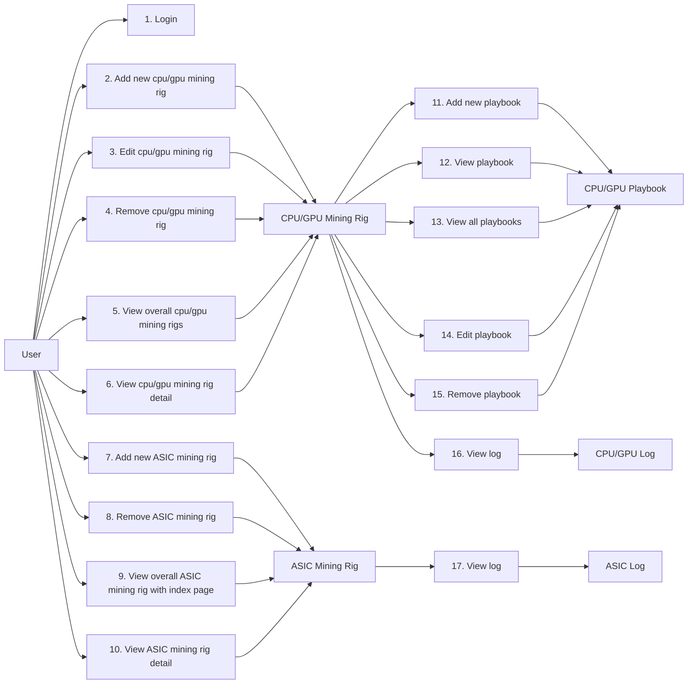
```mermaid
flowchart LR
    User
    cpu-gpu-mining-rig[CPU/GPU Mining Rig]
    asic-mining-rig[ASIC Mining Rig]
    cpu-gpu-playbook[CPU/GPU Playbook]
    cpu-gpu-log[CPU/GPU Log]
    asic-log[ASIC Log]

    User --> f1[1. Login]

    User --> f2[2. Add new cpu/gpu mining rig]
    f2 --> cpu-gpu-mining-rig

    User --> f3[3. Edit cpu/gpu mining rig]
    f3 --> cpu-gpu-mining-rig

    User --> f4[4. Remove cpu/gpu mining rig]
    f4 --> cpu-gpu-mining-rig

    User --> f5[5. View overall cpu/gpu mining rigs]
    f5 --> cpu-gpu-mining-rig

    User --> f6[6. View cpu/gpu mining rig detail]
    f6 --> cpu-gpu-mining-rig


    User --> f5x[7. Add new ASIC mining rig]
    f5x --> asic-mining-rig

    User --> f6x[8. Remove ASIC mining rig]
    f6x --> asic-mining-rig

    User --> f8[9. View overall ASIC mining rig with index page]
    f8 --> asic-mining-rig


    User --> f10[10. View ASIC mining rig detail]
    f10 --> asic-mining-rig


    cpu-gpu-mining-rig --> f11[11. Add new playbook]
    f11 --> cpu-gpu-playbook

    cpu-gpu-mining-rig --> f12[12. View  playbook]
    f12 --> cpu-gpu-playbook

    cpu-gpu-mining-rig --> f13[13. View  all playbooks]
    f13 --> cpu-gpu-playbook

    cpu-gpu-mining-rig --> f14[14. Edit playbook]
    f14 --> cpu-gpu-playbook

    cpu-gpu-mining-rig --> f15[15. Remove playbook]
    f15 --> cpu-gpu-playbook

    cpu-gpu-mining-rig --> f16[16. View log]
    f16 --> cpu-gpu-log

    asic-mining-rig --> f17[17. View log]
    f17 --> asic-log
```

## III. System Design and Architecture
### 1. Data payload processing

The `commander` will be a web server program. Enduser using `commander` will need to open it with web browser such as google chrome, firefox. `cpu/gpu sentry` will be deploy on `cpu/gpu miner`.
On the other hand, `asic sentry` which monitor many `asic miner` will be deployed on an different machine, but in the same network as `asic miner` to make sure that it can collect data from `asic miner`.

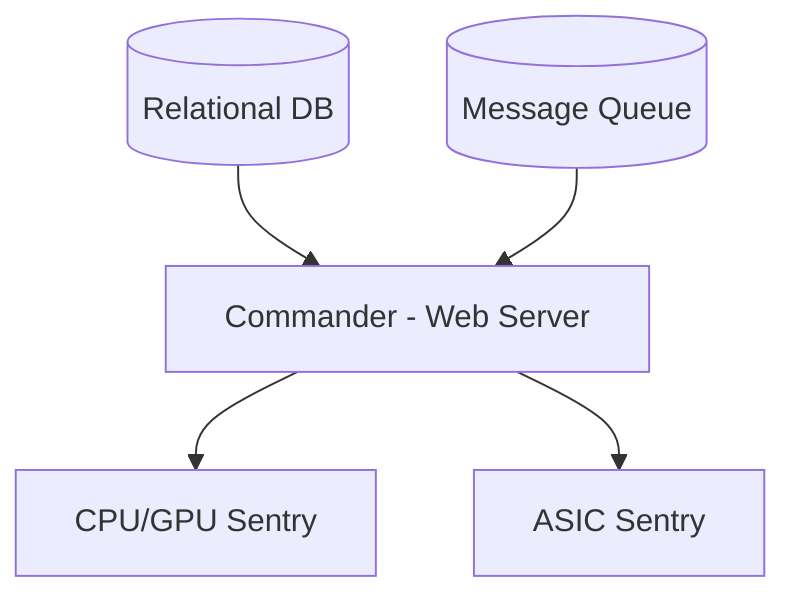
```mermaid
flowchart TB
    relational-database[(Relational DB)]
    mq-database[(Message Queue)]
    commander[Commander - Web Server]
    sentry-cpu-gpu[CPU/GPU Sentry]
    sentry-asic[ASIC Sentry]

    relational-database --> commander
    mq-database --> commander
    commander --> sentry-cpu-gpu
    commander --> sentry-asic
```

Sentry collect logging data from miner, then send to the commander, and it's huge. Due to this amount of data, there is a message queue play as
an intermediate storage before storing in relational database. There are two different data flows:

- Receive logging data and insert into message queue
- Ingest data from message queue and update/insert into relational database.

Regarding communication between `commander` and `sentry`. it's important to secure network via HTTPS. Miners' logging data is sensitive.

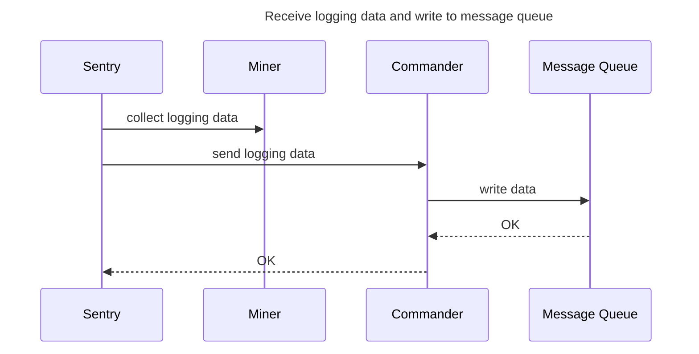
```mermaid
---
title: Receive logging data and write to message queue
---
sequenceDiagram
    Sentry ->> Miner: collect logging data
    Sentry ->> Commander: send logging data
    Commander ->> Message Queue: write data
    Message Queue -->> Commander: OK
    Commander -->> Sentry: OK
```

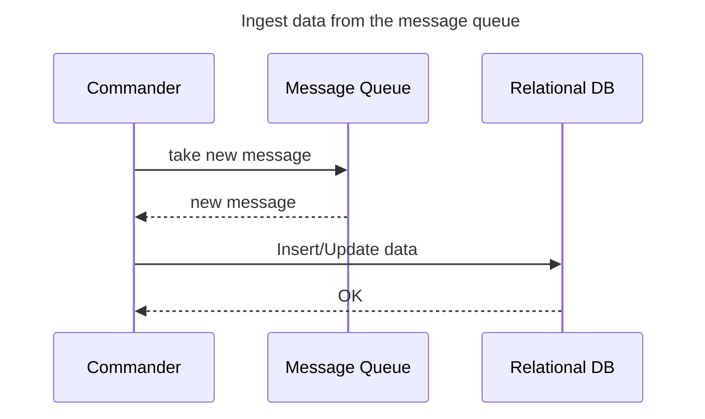
```mermaid
---
title: Ingest data from the message queue
---
sequenceDiagram
    Commander ->> Message Queue: take new message
    Message Queue -->> Commander: new message
    Commander ->> Relational DB: Insert/Update data
    Relational DB -->> Commander: OK
```

### 2. Realtime update
In addition, for each user viewing `commander` dashboard, there is socket connection alive. This technique supports realtime update.

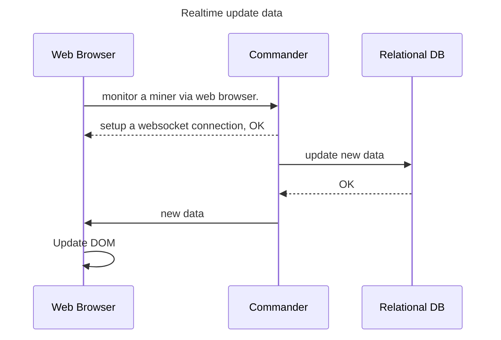
```mermaid
---
title: Realtime update data
---
sequenceDiagram
    Web Browser ->> Commander: monitor a miner via web browser.
    Commander -->> Web Browser: setup a websocket connection, OK

    Commander ->> Relational DB: update new data
    Relational DB -->> Commander: OK
    Commander ->> Web Browser: new data
    Web Browser ->> Web Browser: Update DOM
```

### 3. Setup a sentry for asic miners
User need to install `ASIC Sentry` on a computer first! In addition, make sure that this computer can ping other `asic miners`
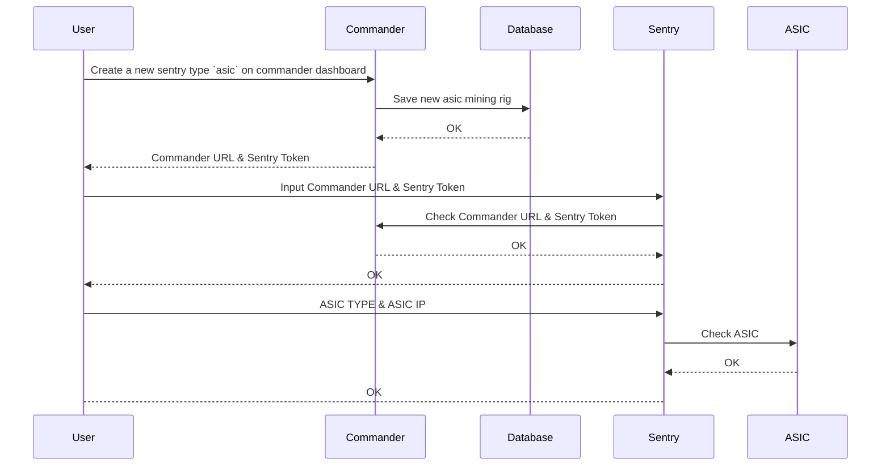
```mermaid
sequenceDiagram
    User ->> Commander: Create a new sentry type `asic` on commander dashboard
    Commander ->> Database: Save new asic mining rig
    Database -->> Commander: OK
    Commander -->> User: Commander URL & Sentry Token


    User ->> Sentry: Input Commander URL & Sentry Token
    Sentry->>Commander: Check Commander URL & Sentry Token
    Commander-->>Sentry: OK
    Sentry-->>User: OK

    User->>Sentry: ASIC TYPE & ASIC IP
    Sentry->>ASIC: Check ASIC
    ASIC-->>Sentry: OK
    Sentry-->User: OK

```

### 4. Setup sentry for cpu/gpu miners

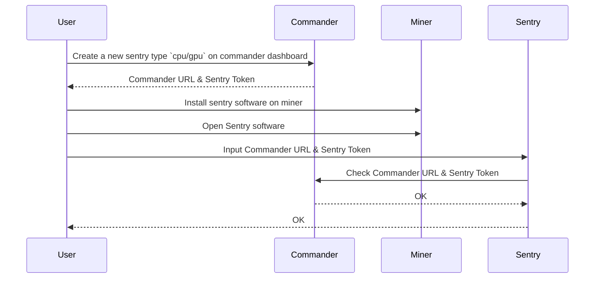
```mermaid
sequenceDiagram
    User ->> Commander: Create a new sentry type `cpu/gpu` on commander dashboard
    Commander -->> User: Commander URL & Sentry Token

    User ->> Miner: Install sentry software on miner
    User ->> Miner: Open Sentry software

    User ->> Sentry: Input Commander URL & Sentry Token
    Sentry->>Commander: Check Commander URL & Sentry Token
    Commander-->>Sentry: OK
    Sentry-->>User: OK
```

### 5. Can asic sentry update mining pool/mining address?
No, the asic API is **private**, asic sentry can collect log from `asic miner`and send it to the `commander` only.

### 6. How does user update mining software/pool/address on cpu/gpu miner?
Given that user did setup cpu/gpu sentry on machine!

#### 6.1 User create mining pool address & mining address in Templates
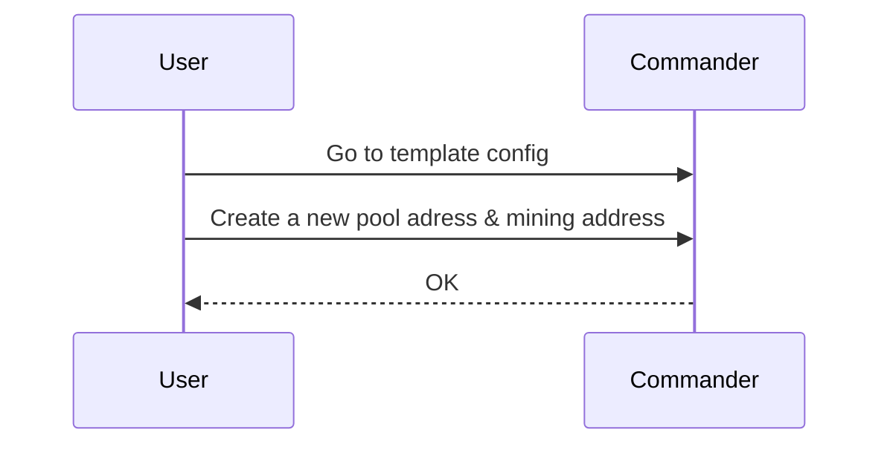
```mermaid
sequenceDiagram
    User ->> Commander: Go to template config
    User ->> Commander: Create a new pool adress & mining address
    Commander -->> User: OK
```

#### 6.2 User configure playbooks for miner.
The term `playbooks` I borrow from ansible.
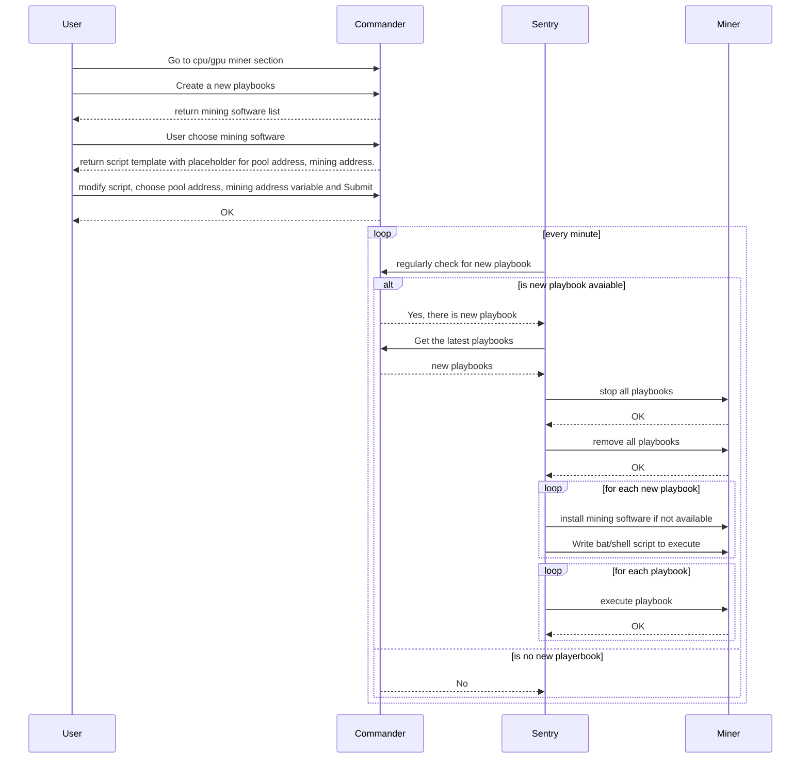
```mermaid
sequenceDiagram
    User ->>Commander: Go to cpu/gpu miner section
    User ->>Commander: Create a new playbooks
    Commander -->> User: return mining software list
    User ->>Commander: User choose mining software
    Commander -->> User: return script template with placeholder for pool address, mining address.
    User ->> Commander: modify script, choose pool address, mining address variable and Submit
    Commander -->> User: OK

    loop every minute
        Sentry ->> Commander: regularly check for new playbook
        alt is new playbook avaiable
            Commander -->> Sentry: Yes, there is new playbook
            Sentry ->> Commander: Get the latest playbooks
            Commander -->> Sentry: new playbooks
            Sentry ->> Miner: stop all playbooks
            Miner -->> Sentry: OK
            Sentry ->> Miner: remove all playbooks
            Miner -->> Sentry: OK
            loop for each new playbook
                Sentry ->> Miner: install mining software if not available
                Sentry ->> Miner: Write bat/shell script to execute
            end
            loop for each playbook
                Sentry ->> Miner: execute playbook
                Miner -->> Sentry: OK
            end
        else is no new playerbook
            Commander -->> Sentry: No
        end
    end
```

## IV. Implementation Details
### 1. Entity Relationship Diagram
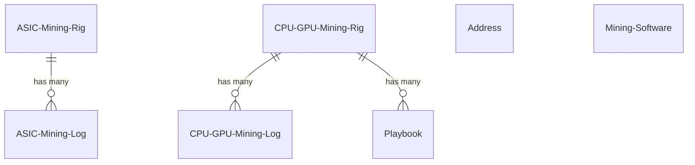
```mermaid
erDiagram
    ASIC-Mining-Rig ||--o{ ASIC-Mining-Log : "has many"
    CPU-GPU-Mining-Rig ||--o{ CPU-GPU-Mining-Log : "has many"
    CPU-GPU-Mining-Rig ||--o{ Playbook : "has many"
    Playbook
    Address
    Mining-Software

```

### 2. Database diagram

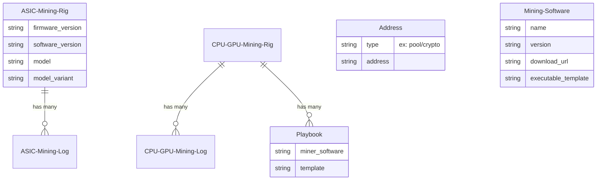
```mermaid
erDiagram
    ASIC-Mining-Rig ||--o{ ASIC-Mining-Log : "has many"
    CPU-GPU-Mining-Rig ||--o{ CPU-GPU-Mining-Log : "has many"
    CPU-GPU-Mining-Rig ||--o{ Playbook : "has many"


    Address {
        string type "ex: pool/crypto"
        string address
    }

    Playbook {
        string miner_software
        string template
    }

    Mining-Software {
        string name
        string version
        string download_url
        string executable_template
    }

    ASIC-Mining-Rig {
        string firmware_version
        string software_version
        string model
        string model_variant
    }

```

### 3. Feature 1: Login
The software is selfhost and  does not have user credentials system. At the time sysadmin deploy the `commander`, there is a configuration for **password**.

!!! note "There is no **limit** number of active login session."

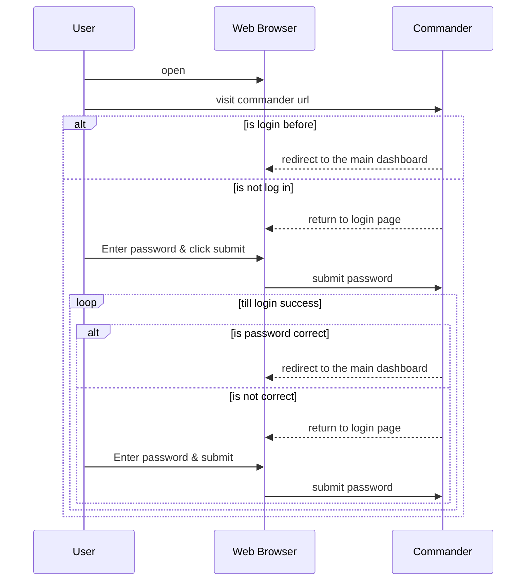
```mermaid
sequenceDiagram
    User ->> Web Browser: open
    User ->> Commander: visit commander url
    alt is login before
        Commander -->> Web Browser: redirect to the main dashboard
    else is not log in
        Commander -->> Web Browser: return to login page
        User ->> Web Browser: Enter password & click submit
        Web Browser ->> Commander: submit password

        loop till login success
            alt is password correct
                Commander -->> Web Browser: redirect to the main dashboard
            else is not correct
                Commander -->> Web Browser: return to login page
                User ->> Web Browser: Enter password & submit
                Web Browser ->> Commander: submit password
            end
        end
    end
```

### 4. Feature 2: Add new cpu/gpu mining rig
Login user are capable create a new cpu/gpu mining rig to monitor, There are two required attributes that users need to provide:

- `mining rig name`: should be distinct
- `mining rig type` (cpu/gpu or asic)

On the other hand, server will return `token`. This token will be used when setup sentry after installing `sentry` on the `cpu/gpu mining rig`.

In addition, given that there are many active login session, here are usecase:

- A new asic mining rig created, people who are viewing `asic mining rig index page`, they will see a new entry on their
`asic mining rig index page` without refresh the page.
- For those who are not viewing `asic mining rig index`, they will not see different nor receive that data payload from
commander about the `new asic mining rig` created

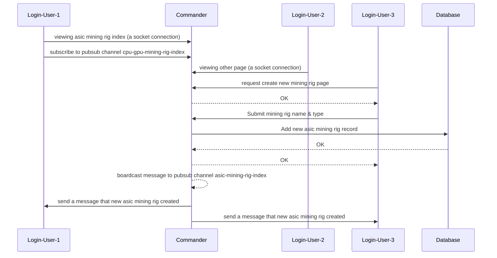
```mermaid
sequenceDiagram
    Login-User-1 ->> Commander: viewing asic mining rig index (a socket connection)
    Login-User-1 ->> Commander: subscribe to pubsub channel cpu-gpu-mining-rig-index
    Login-User-2 ->> Commander: viewing other page (a socket connection)

    Login-User-3 ->> Commander: request create new mining rig page
    Commander -->> Login-User-3: OK
    Login-User-3 ->> Commander: Submit mining rig name & type
    Commander ->> Database: Add new asic mining rig record
    Database -->> Commander: OK
    Commander -->> Login-User-3: OK

    Commander -->> Commander: boardcast message to pubsub channel asic-mining-rig-index

    Commander ->> Login-User-1: send a message that new asic mining rig created
    Commander ->> Login-User-3: send a message that new asic mining rig created
```

!!! Note "Login-User-2 does not receive message that new asic mining rig created."

The broadcast channel named: `cpu-gpu-mining-rig-index`

Data payload schema: `{:asic_mining_rig_index, :created, mining_rig}`

### 5. Feature 3: Edit CPU/GPU mining rig
This feature allows user edit `mining rig name` only. Similar UI realtime update logic as creating new `cpu/gpu mining rig`. Other active login users get
update if they are viewing `asic-mining-rig-index`.

In the sequence diagram below, we consider Login-User-3 is an entity which include his/her web browser.
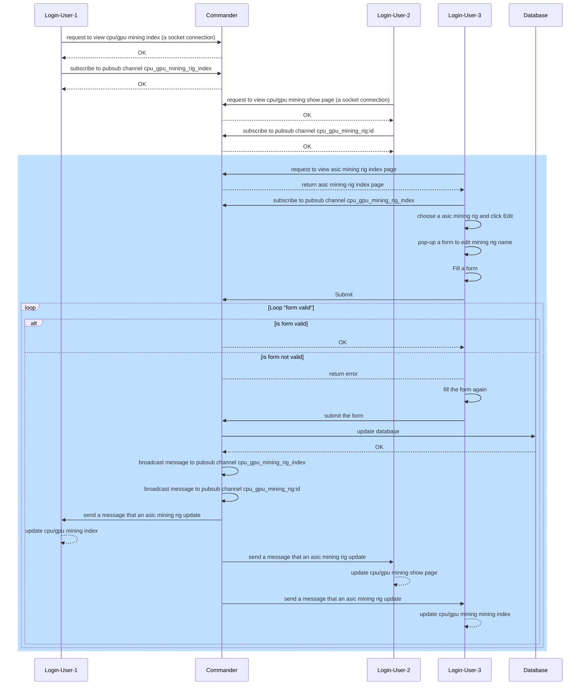
```mermaid
sequenceDiagram
    Login-User-1 ->> Commander: request to view cpu/gpu mining index (a socket connection)
    Commander -->> Login-User-1: OK
    Login-User-1 ->> Commander: subscribe to pubsub channel cpu_gpu_mining_rig_index
    Commander -->> Login-User-1: OK

    Login-User-2 ->> Commander: request to view cpu/gpu mining show page (a socket connection)
    Commander -->> Login-User-2: OK
    Login-User-2 ->> Commander: subscribe to pubsub channel cpu_gpu_mining_rig:id
    Commander -->> Login-User-2: OK


    rect rgb(191, 223, 255)
        Login-User-3 ->> Commander: request to view asic mining rig index page
        Commander -->> Login-User-3: return asic mining rig index page
        Login-User-3 ->> Commander: subscribe to pubsub channel cpu_gpu_mining_rig_index
        Login-User-3 ->> Login-User-3: choose a asic mining rig and click Edit
        Login-User-3 ->> Login-User-3: pop-up a form to edit mining rig name
        Login-User-3 ->> Login-User-3: Fill a form
        Login-User-3 ->> Commander: Submit

        loop Loop "form valid"
            alt is form valid
                Commander -->> Login-User-3: OK
            else is form not valid
                Commander --> Login-User-3: return error
                Login-User-3 ->> Login-User-3: fill the form again
                Login-User-3 ->> Commander: submit the form
                Commander ->> Database: update database
                Database -->> Commander: OK
                Commander ->> Commander: broadcast message to pubsub channel cpu_gpu_mining_rig_index
                Commander ->> Commander: broadcast message to pubsub channel cpu_gpu_mining_rig:id

                Commander ->> Login-User-1: send a message that an asic mining rig update
                Login-User-1 -->> Login-User-1: update cpu/gpu mining index

                Commander ->> Login-User-2: send a message that an asic mining rig update
                Login-User-2 -->> Login-User-2: update cpu/gpu mining show page

                Commander ->> Login-User-3: send a message that an asic mining rig update
                Login-User-3 -->> Login-User-3: update cpu/gpu mining mining index
            end
        end
    end
```

There are two pubsub channels involved:

- `cpu_gpu_mining_rig_index`
    - data payload schema for subscriber: `{:cpu-gpu_mining_rig_index, :updated, mining_rig}`
- `cpu_gpu_mining_rig:mining_rig_id`, mining-rig-id is the primary key of cpu/gpu mining rig.
    - data payload schema for subscriber: `{:cpu_gpu_mining_rig:id, :updated, mining_rig}`.

### 6. Feature 4: Remove cpu/gpu mining rig
This feature involves `Commander` and `Sentry`. When user remove `cpu/gpu mining rig` on commander, and `sentry` is setup on mining rig,
`sentry` will do the following actions

- stop all running playbooks
- remove all playbook and mining software such as xmrig, phoenix miner, bzminer ...
- stop sending log to `commander`
- open an UI asking for `token`

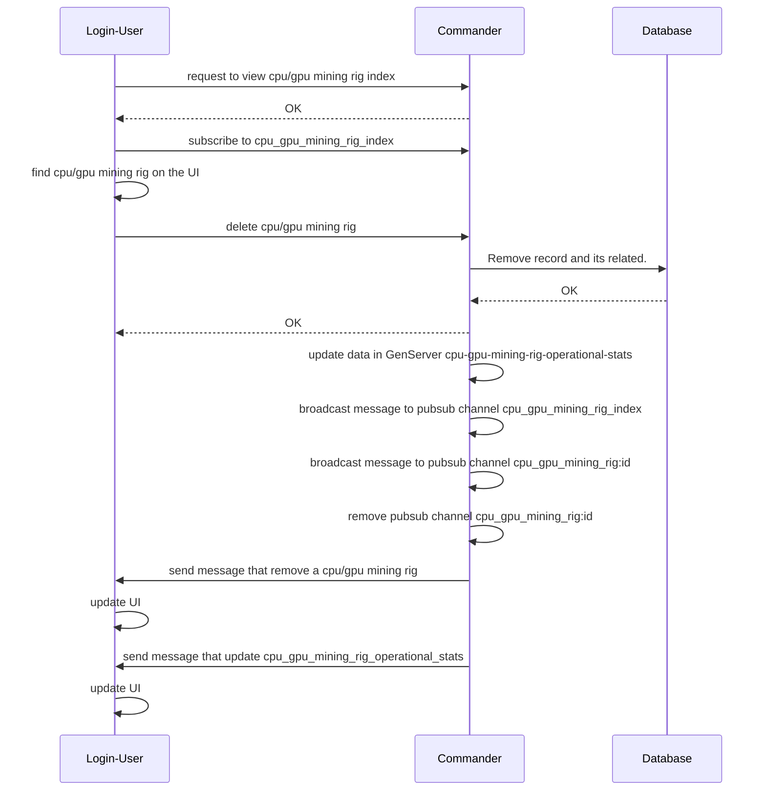
```mermaid
sequenceDiagram
Login-User ->> Commander: request to view cpu/gpu mining rig index
Commander -->> Login-User: OK
Login-User ->> Commander: subscribe to cpu_gpu_mining_rig_index
Login-User ->> Login-User: find cpu/gpu mining rig on the UI
Login-User ->> Commander: delete cpu/gpu mining rig
Commander ->> Database: Remove record and its related.
Database -->> Commander: OK
Commander -->> Login-User: OK

Commander ->> Commander: update data  in GenServer cpu-gpu-mining-rig-operational-stats
Commander ->> Commander: broadcast message to pubsub channel cpu_gpu_mining_rig_index
Commander ->> Commander: broadcast message to pubsub channel cpu_gpu_mining_rig:id
Commander ->> Commander: remove pubsub channel cpu_gpu_mining_rig:id

Commander ->> Login-User: send message that remove a cpu/gpu mining rig
Login-User ->> Login-User: update UI

Commander ->> Login-User: send message that update cpu_gpu_mining_rig_operational_stats
Login-User ->> Login-User: update UI
```

!!! Note "GenServer cpu-gpu-mining-rig-index-operational-stats"
    This genserver store aggregate stats of many cpu/gpu mining rigs such as: total hashrate by coin, total power consumption.
    When a mining rig removed, this stats need to be updated.

!!! Note "For active loging user viewing cpu-gpu mining rig detail/show page"
    Cause they are viewing a mining rig which is deleted, they will be redirect to cpu-gpu-mining-rig-index page

### 7. Feature 5: View overall cpu/gpu mining rigs

This feature allows user view overall all cpu/gpu mining rigs (cpu/gpu mining rig index page). This page has realtime update data.
When user visit this page, a socket connection established. on the web framework Phoenix, this socket connection process subscribe to a pubsub
channel

- `cpu-gpu-mining-rig-index`: only for cpu/gpu mining rig
- `cpu-gpu-mining-rig-operational-stats`: only for cpu/gpu mining rig operational stats, such as hashrate, total hashrate by coin,
aggregated stats for all rigs.

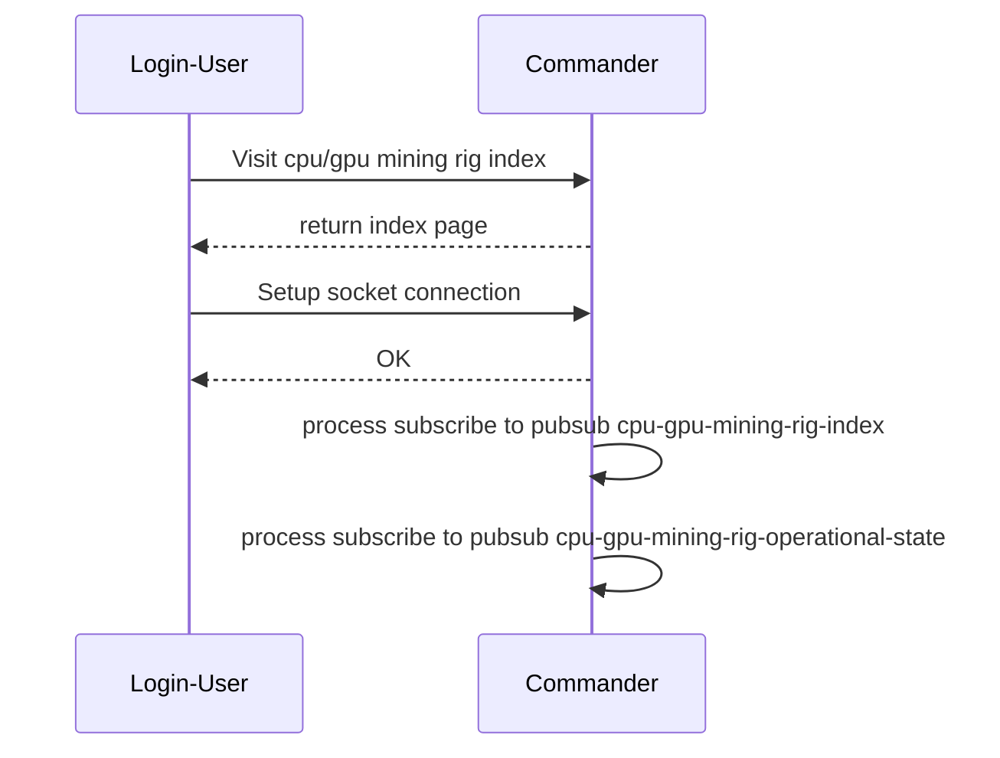
```mermaid
sequenceDiagram
    Login-User ->> Commander: Visit cpu/gpu mining rig index
    Commander -->> Login-User: return index page
    Login-User ->> Commander: Setup socket connection
    Commander -->> Login-User: OK
    Commander ->> Commander: process subscribe to pubsub cpu-gpu-mining-rig-index
    Commander ->> Commander: process subscribe to pubsub cpu-gpu-mining-rig-operational-state
```

### 8. Feature 6: View cpu/gpu mining rig detail

This feature allows user view cpu/gpu mining rig details with realtime update data. When user visit this page,
a socket connection established. On the web framework Phoenix, this socket connection process subscribe to a pubsub
channel
- `cpu-gpu-mining-rig:id`: for mining rig data such as spec, name
- `cpu-gpu-mining-rig-operational-stats:id`: for operational data.

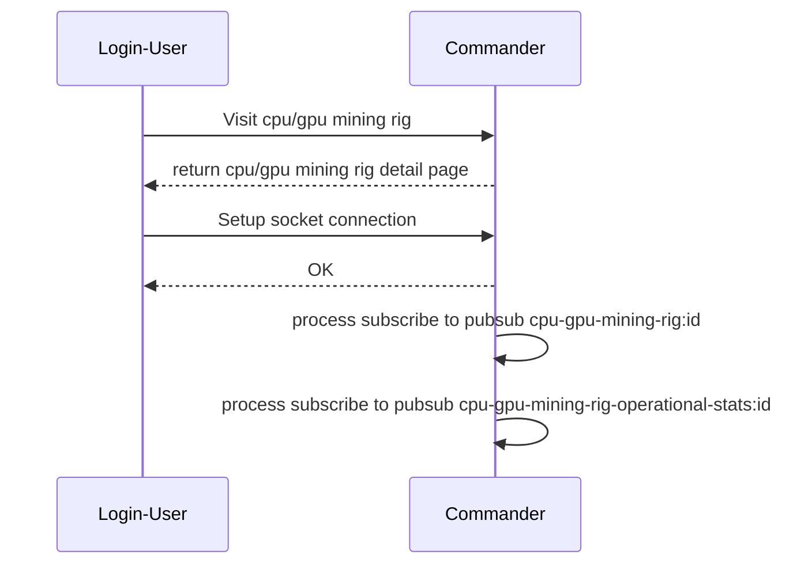
```mermaid
sequenceDiagram
    Login-User ->> Commander: Visit cpu/gpu mining rig
    Commander -->> Login-User: return cpu/gpu mining rig detail page
    Login-User ->> Commander: Setup socket connection
    Commander -->> Login-User: OK
    Commander ->> Commander: process subscribe to pubsub cpu-gpu-mining-rig:id
    Commander ->> Commander: process subscribe to pubsub cpu-gpu-mining-rig-operational-stats:id
```

On this page, if mining rig update (such as rig name), a message will broadcasted to channel `cpu-gpu-mining-rig:id`.

As a subcriber, the listener need to handle these schema in `handle_info/3`
- `{cpu-gpu-mining-rig, :updated, mining_rig}`
- `{cpu-gpu-mining-rig, :deleted, mining_rig}`

In addition, if mining rig operational data get updated, a message will be broadcasted to channel `cpu-gpu-mining-rig-operational-stats:id`

- `{cpu-gpu-mining-rig-operational-stats, :created, new_log`

## V. Testing and Validation
