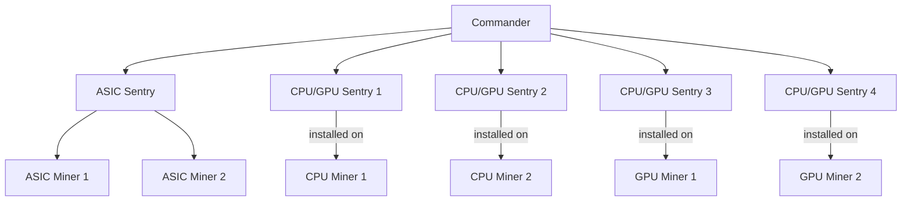

# Index

## Abstract
There are two three tiers regarding monitoring mining rigs.

- commander
- sentry
- mining rig:
    - gpu miner
    - cpu miner
    - asic miner

The source code is focusing on the `commander` and `sentry`.  There is one `commander` for mining farm, and many `sentry`. A sentry is installed on each `gpu miner`/ `cpu miner`. On the other hand, one sentry can monitor many `asic miner`.

