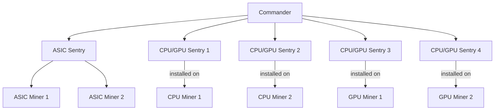

# Introduction

At first, I am inspired of many mining rig monitor software such as Minerstats, HiveOS, BrainOS. They do good jobs, They really help the community so much, the crypto industry
really appriciate their contribution. In particular, I am a minerstats user, and I love their software! Really cool! This software is an opensource version of Minerstat which
do monitor mining rigs.

For a mining farm, they can selfhost this software and play with it!

If someone could create such a great thing and opensource it (Bitcoin, Monero, Xmrig, Linux kernel, and many many thing ....), yes, this piece of software can be opensource too!

I will try my best to deliver it, and I really hope so! Or it's just another time, I would fail! but it's worth a try!

---
There are two three tiers regarding monitoring mining rigs.

- Commander
- Sentry
- Mining rig:
    - GPU miner
    - CPU miner
    - ASIC miner

The source code is focusing on the `commander` and `sentry`.  There is one `commander` for mining farm, and many `sentry`. A sentry is installed on each `gpu miner`/ `cpu miner`. On the other hand, one sentry can monitor many `asic miner`.

Regarding sentry, **sentry source code** for `asic miners` should be diffirent from **sentry** for `cpu/gpu miners`.

One `asic sentry` can monitor many `asic miners`.

One `cpu / gpu sentry` can monitor one `cpu/gpu miner`. **Beware that a machine can mine with CPU and GPU at the sametime.**

When `sentry` get operational data from `miners`, they will report/forward data to the `commander`.

In addition, the diagram above does not represent how we do deploy cause it does not have backup machine for `commander`.
