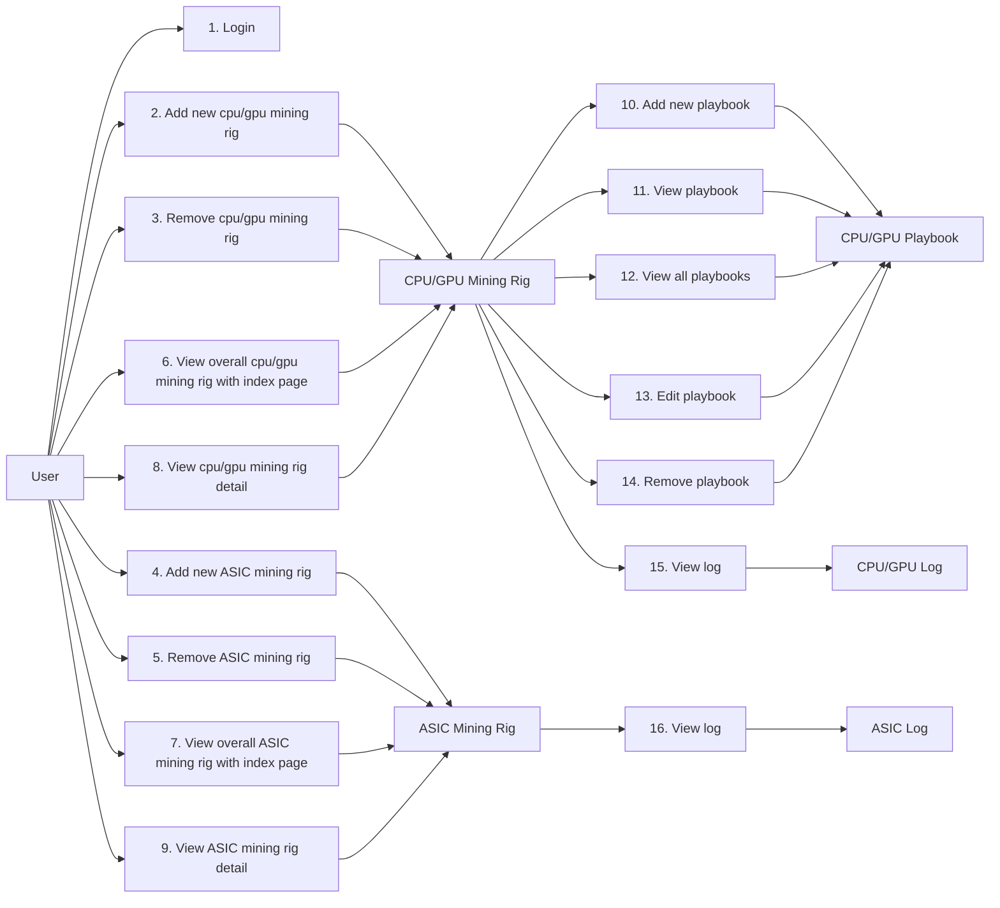

# Index

## I. Introduction
At first, I am inspired of many mining rig monitor software such as Minerstats, HiveOS, BrainOS. They do good jobs, They really help the community so much, the crypto industry
really appriciate their contribution. In particular, I am a minerstats user, and I love their software! Really cool! This software is an opensource version of Minerstat which
do monitor mining rigs.

For a mining farm, they can selfhost this software and play with it!

If someone could create such a great thing and opensource it (Bitcoin, Monero, Xmrig, Linux kernel, and many many thing ....), yes, this piece of software can be opensource too!

I will try my best to deliver it, and I really hope so! Or it's just another time, I would fail! but it's worth a try!

---
There are two three tiers regarding monitoring mining rigs.

- Commander
- Sentry
- Mining rig:
    - GPU miner
    - CPU miner
    - ASIC miner

The source code is focusing on the `commander` and `sentry`.  There is one `commander` for mining farm, and many `sentry`. A sentry is installed on each `gpu miner`/ `cpu miner`. On the other hand, one sentry can monitor many `asic miner`.

Regarding sentry, **sentry source code** for `asic miners` should be diffirent from **sentry** for `cpu/gpu miners`.

One `asic sentry` can monitor many `asic miners`.

One `cpu / gpu sentry` can monitor one `cpu/gpu miner`. **Beware that a machine can mine with CPU and GPU at the sametime.**

When `sentry` get operational data from `miners`, they will report/forward data to the `commander`.

In addition, the diagram above does not represent how we do deploy cause it does not have backup machine for `commander`.

## II. Features
- Remote control mining rigs cpu/gpu including assign mining software (such as bzminer, lolminer, xmrig...), mining pool, mining address.
- Allow multiple mining software running (cpu miner, gpu miner).
- Monitor cpu/gpu miner.
- Monitor asic miner.

## III. System Design and Architecture
### 1. Data payload processing

The `commander` will be a web server program. Enduser using `commander` will need to open it with web browser such as google chrome, firefox. `cpu/gpu sentry` will be deploy on `cpu/gpu miner`.
On the other hand, `asic sentry` which monitor many `asic miner` will be deployed on an different machine, but in the same network as `asic miner` to make sure that it can collect data from `asic miner`.

Sentry collect logging data from miner, then send to the commander, and it's huge. Due to this amount of data, there is a message queue play as
an intermediate storage before storing in relational database. There are two different data flows:

- Receive logging data and insert into message queue
- Ingest data from message queue and update/insert into relational database.

Regarding communication between `commander` and `sentry`. it's important to secure network via HTTPS. Miners' logging data is sensitive.

### 2. Realtime update
In addition, for each user viewing `commander` dashboard, there is socket connection alive. This technique supports realtime update.

### 3. Setup a sentry for asic miners
User need to install `ASIC Sentry` on a computer first! In addition, make sure that this computer can ping other `asic miners`

### 4. Setup sentry for cpu/gpu miners

### 5. Can asic sentry update mining pool/mining address?
No, the asic API is **private**, asic sentry can collect log from `asic miner`and send it to the `commander` only.

### 6. How does user update mining software/pool/address on cpu/gpu miner?
Given that user did setup cpu/gpu sentry on machine!

#### 6.1 User create mining pool address & mining address in Templates

#### 6.2 User configure playbooks for miner.
The term `playbooks` I borrow from ansible.

## IV. Implementation Details
### 1. Entity Relationship Diagram

### 2. Database diagram

## V. Testing and Validation
