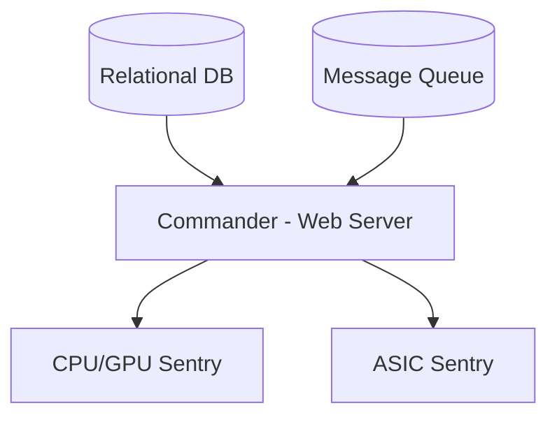
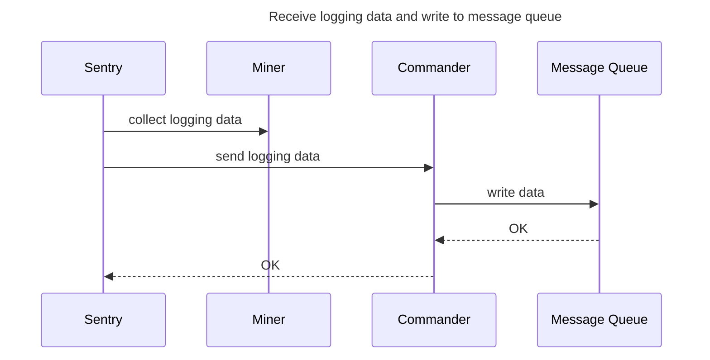
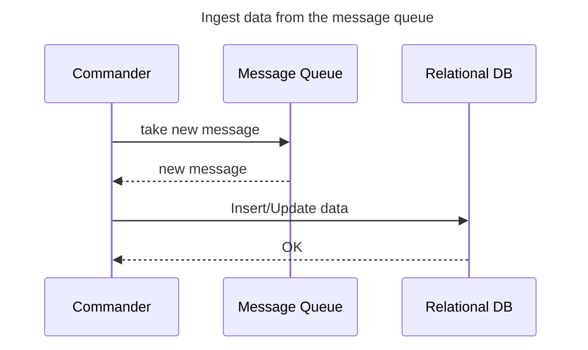
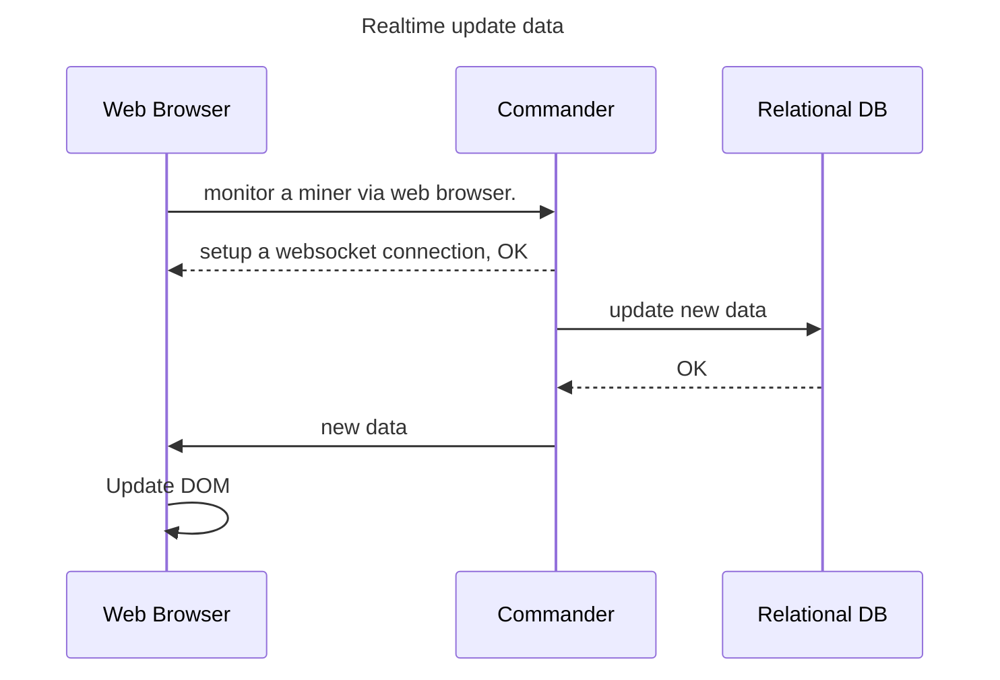
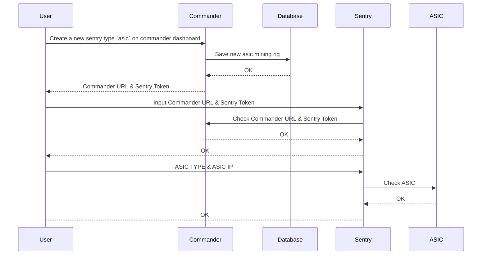
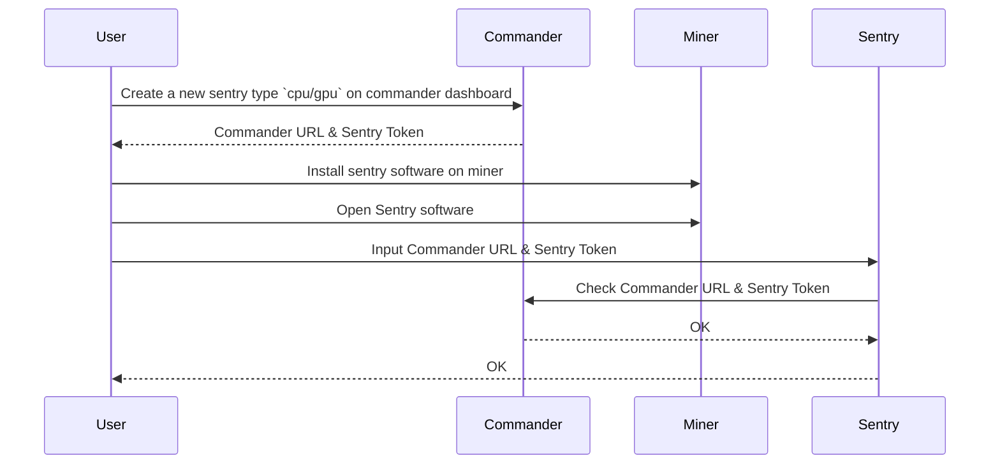
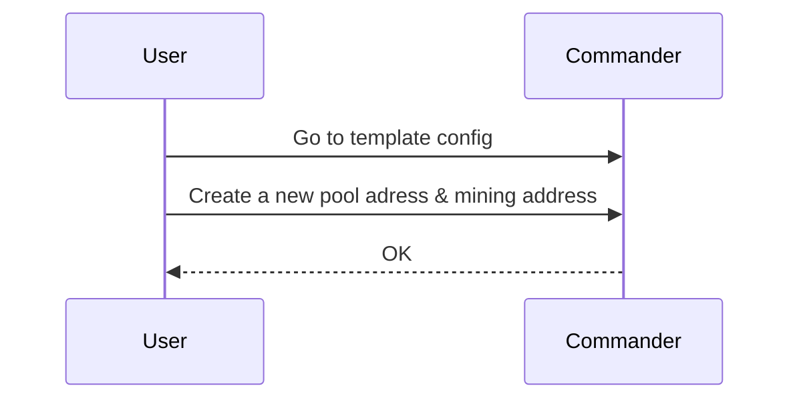
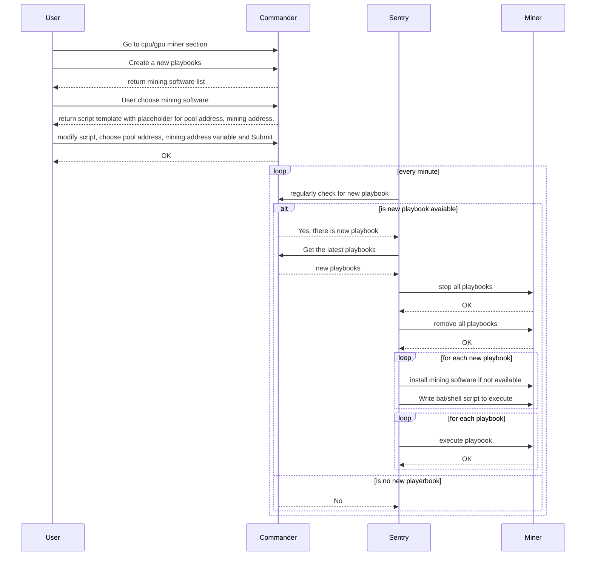

# System Design and Architecture
## 1. Data payload processing

The `commander` will be a web server program. Enduser using `commander` will need to open it with web browser such as google chrome, firefox. `cpu/gpu sentry` will be deploy on `cpu/gpu miner`.
On the other hand, `asic sentry` which monitor many `asic miner` will be deployed on an different machine, but in the same network as `asic miner` to make sure that it can collect data from `asic miner`.

Sentry collect logging data from miner, then send to the commander, and it's huge. Due to this amount of data, there is a message queue play as
an intermediate storage before storing in relational database. There are two different data flows:

- Receive logging data and insert into message queue
- Ingest data from message queue and update/insert into relational database.

Regarding communication between `commander` and `sentry`. it's important to secure network via HTTPS. Miners' logging data is sensitive.

## 2. Realtime update
In addition, for each user viewing `commander` dashboard, there is socket connection alive. This technique supports realtime update.

## 3. Setup a sentry for asic miners
User need to install `ASIC Sentry` on a computer first! In addition, make sure that this computer can ping other `asic miners`

### 4. Setup sentry for cpu/gpu miners

## 5. Can asic sentry update mining pool/mining address?
No, the asic API is **private**, asic sentry can collect log from `asic miner`and send it to the `commander` only.

## 6. How does user update mining software/pool/address on cpu/gpu miner?
Given that user did setup cpu/gpu sentry on machine!

### 6.1 User create mining pool address & mining address in Templates

### 6.2 User configure playbooks for miner.
The term `playbooks` I borrow from ansible.

